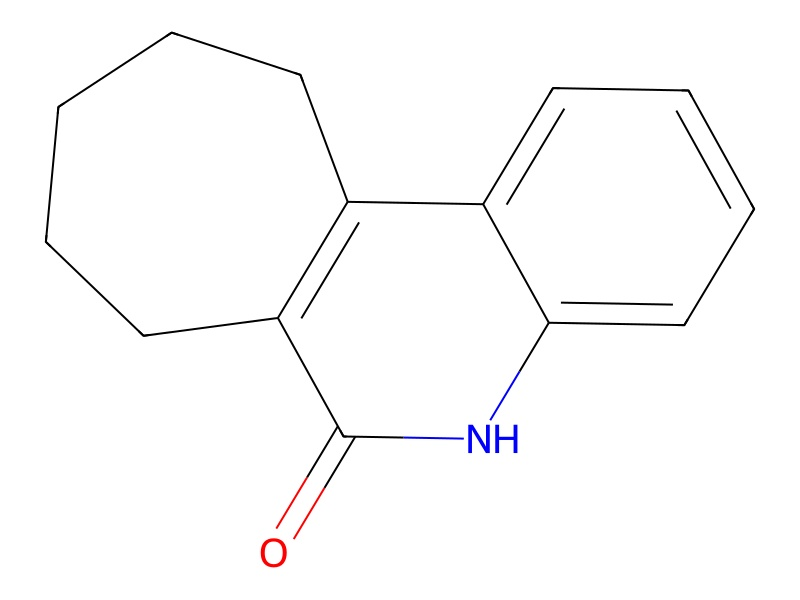
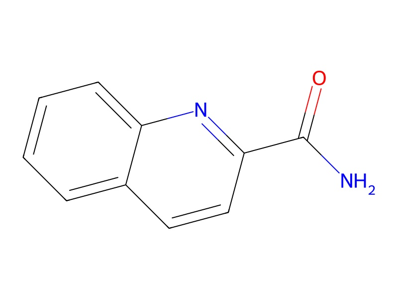
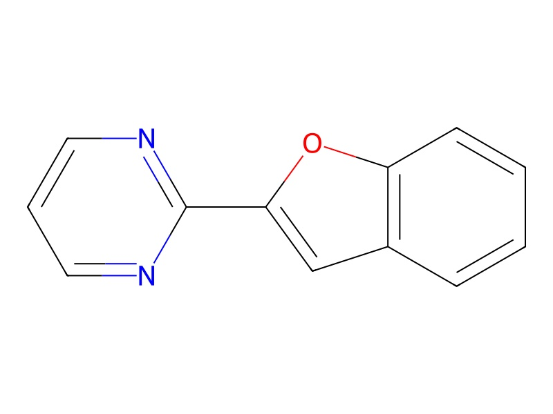
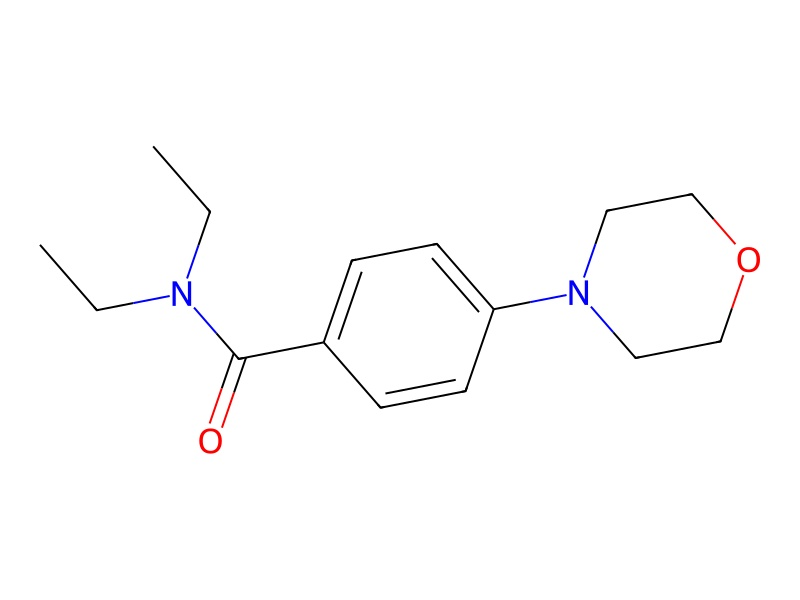
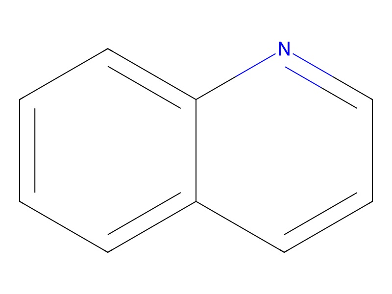
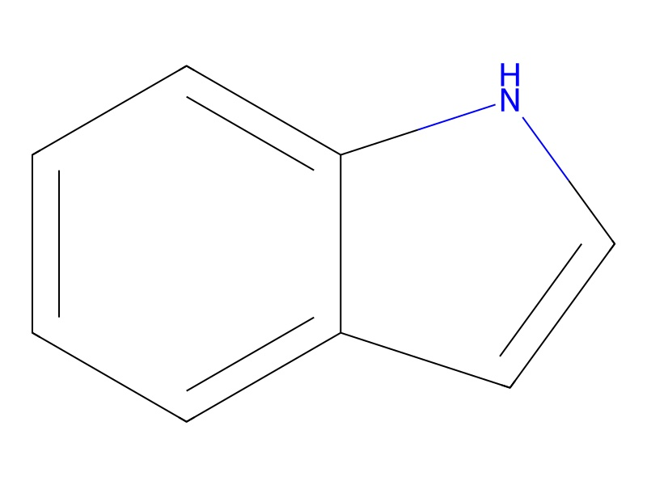
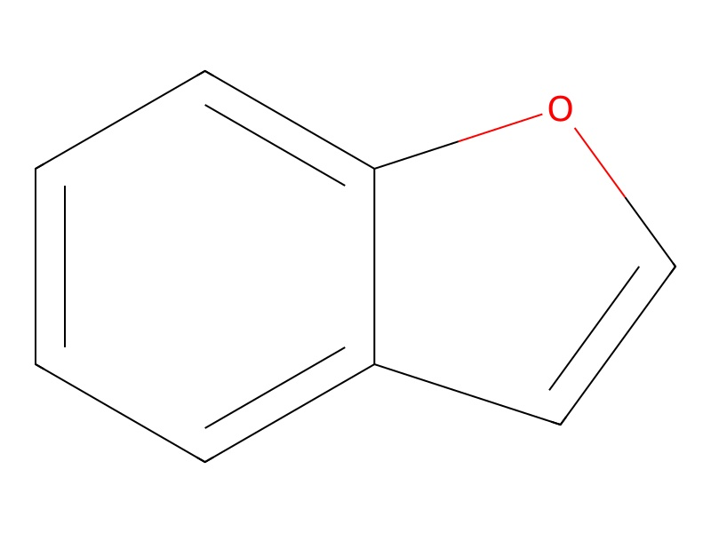

# Gold Standard Patent and Competitive Landscape Report: Small Molecule cGAS Inhibitors

**Comprehensive Analysis for Strategic Decision-Making in R&D, Business Development, and Freedom-to-Operate**

---

**Report Date:** July 18, 2025  
**Analysis Period:** 2015-2025 (with emphasis on 2022-2025 developments)  
**Scope:** Global patent landscape covering US, EP, WO, CN, JP jurisdictions  
**Target Audience:** R&D Strategy, Business Development, Patent Strategy, and Investment Decision-Making  

---

## Table of Contents

1. [Executive Summary](#1-executive-summary)
2. [Introduction](#2-introduction)
3. [Overall Patent Landscape](#3-overall-patent-landscape)
4. [Competitive Landscape & Strategic Analysis](#4-competitive-landscape--strategic-analysis)
5. [Analysis of Claimed Chemical Space](#5-analysis-of-claimed-chemical-space)
6. [Structure-Activity Relationship (SAR) Insights](#6-structure-activity-relationship-sar-insights)
7. [Freedom-to-Operate (FTO) Considerations](#7-freedom-to-operate-fto-considerations)
8. [Future Trends, White Space & Strategic Outlook](#8-future-trends-white-space--strategic-outlook)
9. [Conclusion](#9-conclusion)
10. [Appendix](#10-appendix)

---

## 1. Executive Summary

### 1.1 Market Landscape Overview

The small molecule cGAS (cyclic GMP-AMP synthase) inhibitor landscape has reached a critical inflection point in 2024-2025, transitioning from a research-stage therapeutic area to a clinically validated field with significant commercial potential. This comprehensive analysis reveals a dynamic and rapidly evolving patent landscape characterized by intense competition among both established pharmaceutical companies and innovative biotechnology firms.

**Key Market Dynamics:**
- **Clinical Validation Achieved:** Two oral cGAS inhibitors (IMSB-301 and VENT-03) have successfully completed Phase 1 trials in 2024, demonstrating safety, tolerability, and target engagement
- **Significant Investment Activity:** Over $1.2 billion in disclosed deals and funding, including Novartis's $835 million acquisition of IFM Due's STING antagonist program
- **Regulatory Momentum:** FDA Orphan Drug and Rare Pediatric Disease Designations granted to IMSB-301 for Aicardi-Goutières Syndrome (AGS)
- **Market Expansion:** Target indications expanding beyond autoimmune diseases to neurodegeneration, fibrosis, and cardiometabolic disorders

### 1.2 Patent Landscape Highlights

**Filing Activity Trends:**
- **Peak Activity Period:** 2017-2022 with sustained high activity through 2024
- **Geographic Coverage:** >75% of patents filed in WO/PCT and US jurisdictions, >70% in EP, >50% in CN and JP
- **Chemical Diversity:** Eight distinct scaffold classes with novel azepino[4,5-b]indolone and quinoline derivatives leading clinical development

**Competitive Intelligence:**
- **Clinical Leaders:** Ventus Therapeutics (VENT-03, Phase 2) and ImmuneSensor Therapeutics (IMSB-301, Phase 1)
- **Big Pharma Presence:** Novartis, Merck & Co, Roche, Pfizer, and Boehringer Ingelheim with significant patent portfolios
- **Innovation Platforms:** Structure-based design (Ventus ReSOLVE®) and pathway expertise (ImmuneSensor/Dr. Zhijian Chen) driving competitive advantages

### 1.3 Strategic Implications

**Critical Success Factors Identified:**
1. **Novel Chemical Space:** Breakthrough scaffolds like azepino[4,5-b]indolones provide strong FTO positions
2. **Biomarker-Driven Development:** Type I interferon signatures enable patient selection and target engagement assessment
3. **Indication Strategy:** Rare disease focus (AGS) versus major market entry (SLE) represent distinct risk/reward profiles
4. **Platform Technologies:** Proprietary discovery capabilities command premium valuations and sustainable competitive advantages

**Investment Thesis:**
The successful clinical advancement of multiple cGAS inhibitors validates the therapeutic potential and commercial viability of this mechanism, positioning the field for significant growth across autoimmune, inflammatory, and neurodegenerative diseases. Organizations with novel chemical scaffolds, robust biomarker strategies, and strong IP positions are positioned to capture substantial value in this emerging market.

---

## 2. Introduction

### 2.1 The cGAS-STING Pathway: Biological Foundation

The cyclic GMP-AMP synthase (cGAS) - stimulator of interferon genes (STING) pathway represents one of the most significant discoveries in innate immunity of the past decade. First characterized by Dr. Zhijian "James" Chen at the University of Texas Southwestern in 2013, this pathway serves as a critical cytosolic DNA sensor that triggers type I interferon responses and inflammatory signaling.

**Pathway Mechanism:**
1. **DNA Recognition:** cGAS detects cytosolic double-stranded DNA (dsDNA) from various sources including damaged mitochondria, nuclear DNA leakage, or pathogenic organisms
2. **Second Messenger Production:** Upon DNA binding, cGAS synthesizes the cyclic dinucleotide 2'3'-cGAMP (cyclic GMP-AMP)
3. **STING Activation:** cGAMP binds to and activates STING, leading to IRF3 and NF-κB activation
4. **Inflammatory Response:** Downstream signaling results in type I interferon production and inflammatory cytokine release

**Therapeutic Rationale:**
While this pathway is essential for antimicrobial defense, aberrant activation contributes to numerous autoimmune and inflammatory diseases. Excessive cGAS-STING signaling has been implicated in systemic lupus erythematosus (SLE), Aicardi-Goutières syndrome (AGS), rheumatoid arthritis, and various interferonopathies, making cGAS an attractive therapeutic target for selective pathway inhibition.

### 2.2 Disease Relevance and Market Opportunity

**Primary Target Indications:**

**Aicardi-Goutières Syndrome (AGS):**
- Rare genetic interferonopathy affecting ~1 in 120,000 births
- Caused by mutations in DNA repair enzymes (TREX1, SAMHD1, others)
- Characterized by severe neurological dysfunction and early mortality
- cGAS knockout rescues lethal phenotype in TREX1-deficient mice, providing strong genetic validation

**Systemic Lupus Erythematosus (SLE):**
- Affects ~5 million people worldwide with significant unmet medical need
- Characterized by anti-dsDNA antibodies and elevated type I interferon signatures
- Current therapies provide limited efficacy with significant side effects
- Market size estimated at $7.5 billion globally

**Rheumatoid Arthritis (RA):**
- Affects ~1.3 million Americans with $25 billion annual market
- Increased cytosolic dsDNA and cGAS expression observed in synovial cells
- Potential for combination therapy with existing DMARDs

**Emerging Indications:**
- **Neurodegeneration:** Alzheimer's disease, Parkinson's disease, ALS ($150+ billion market opportunity)
- **Fibrotic Diseases:** NASH, pulmonary fibrosis, chronic kidney disease
- **Cardiometabolic Disorders:** Diabetic complications, atherosclerosis

### 2.3 Historical Development Timeline

**2013-2015: Discovery and Validation**
- cGAS-STING pathway discovery and characterization
- Initial proof-of-concept studies demonstrating therapeutic potential
- Early academic patent filings establishing foundational IP

**2016-2018: Early Drug Discovery**
- First small molecule inhibitors reported (PF-06928215, G150)
- Pharmaceutical industry recognition and initial patent filings
- Challenges with cellular activity and species selectivity identified

**2019-2021: Platform Development**
- Advanced discovery platforms developed (Ventus ReSOLVE®)
- Novel chemical scaffolds identified with improved properties
- Significant venture funding and strategic partnerships initiated

**2022-2024: Clinical Translation**
- IMSB-301 and VENT-03 advance to clinical trials
- Successful Phase 1 completion demonstrating safety and target engagement
- Major business development activity including Novartis-IFM Due acquisition

**2025: Market Validation**
- VENT-03 advances to Phase 2 for SLE
- IMSB-301 receives FDA Orphan Drug and Rare Pediatric Disease Designations
- Multiple next-generation programs advancing toward clinical development

---

## 3. Overall Patent Landscape

### 3.1 Patent Filing Trends and Activity

The cGAS inhibitor patent landscape demonstrates a clear evolution from foundational academic discoveries to intensive commercial development, with filing activity closely correlating with clinical validation milestones and market recognition.

**Temporal Filing Patterns:**

**2015-2016: Foundation Phase**
- Low filing activity (estimated 5-10 patents annually)
- Primarily academic institutions and early-stage research
- Focus on basic mechanism validation and initial screening hits

**2017-2019: Expansion Phase**
- Dramatic increase to peak activity (25-35 patents annually)
- Major pharmaceutical companies enter the field
- Diverse chemical scaffolds and optimization strategies emerge

**2020-2022: Maturation Phase**
- Sustained high activity (25-30 patents annually)
- Focus shifts to clinical candidates and advanced optimization
- Increased emphasis on specific indications and combination approaches

**2023-2025: Validation Phase**
- Moderate-high activity (20-25 patents annually)
- Clinical data drives continued investment
- Next-generation mechanisms and novel scaffolds emerge

**Key Observations:**
1. **Rapid Market Entry:** The transition from discovery (2013) to peak patent activity (2017-2019) occurred within 4-6 years, indicating strong commercial interest
2. **Sustained Innovation:** Continued filing activity through 2024-2025 suggests ongoing innovation and competitive dynamics
3. **Clinical Correlation:** Filing patterns correlate with clinical milestones, with increased activity following successful Phase 1 results

### 3.2 Geographic Distribution and Jurisdictional Strategy

The global filing strategy for cGAS inhibitors reflects the international nature of pharmaceutical development and the importance of major markets for autoimmune and rare diseases.

**Jurisdictional Coverage Analysis:**

**World Intellectual Property Organization (WO/PCT): >75%**
- Serves as primary filing route for international protection
- Enables strategic national phase entry decisions
- Cost-effective approach for broad geographic coverage

**United States (US): >75%**
- Critical market for rare disease and autoimmune therapies
- Strong IP enforcement and patent term extensions available
- FDA regulatory pathways for orphan drugs provide commercial advantages

**European Patent Office (EP): >70%**
- Key market with harmonized patent prosecution
- Strong enforcement mechanisms across member states
- EMA orphan drug designations complement patent protection

**China (CN): >50%**
- Rapidly growing pharmaceutical market with increasing IP respect
- Consistent national phase entry indicates long-term commercial interest
- Government support for innovative drug development

**Japan (JP): >50%**
- Mature pharmaceutical market with strong IP protection
- Aging population creates significant market opportunity for autoimmune diseases
- PMDA regulatory pathways support innovative drug development

**Strategic Implications:**
1. **Global Market Focus:** High filing rates across all major jurisdictions indicate global commercial strategies
2. **Market Prioritization:** Slightly higher US/EP filing rates reflect primary market focus for autoimmune diseases
3. **Emerging Market Recognition:** Significant CN filing activity demonstrates recognition of long-term growth potential

### 3.3 Patent Family Analysis and Key Trends

**Major Patent Family Categories:**

**Foundational Composition of Matter Patents:**
- Core chemical scaffolds and their derivatives
- Broad genus claims covering multiple substitution patterns
- Priority dates typically 2016-2020 for major scaffolds

**Specific Compound Patents:**
- Individual clinical candidates and optimized analogs
- Detailed structure-activity relationship data
- Priority dates 2019-2024 for advanced compounds

**Method of Use Patents:**
- Disease-specific therapeutic applications
- Combination therapy approaches
- Biomarker-based patient selection methods

**Process and Formulation Patents:**
- Manufacturing methods and synthetic routes
- Pharmaceutical formulations and delivery systems
- Stability and bioavailability improvements

**Emerging Technology Patents:**
- Novel mechanisms (allosteric inhibition, PROTACs)
- Diagnostic and companion diagnostic applications
- Platform technologies and screening methods

---

## 4. Competitive Landscape & Strategic Analysis

### 4.1 Clinical-Stage Leaders

#### 4.1.1 Ventus Therapeutics - Market Pioneer

**Company Overview:**
Founded in 2019, Ventus Therapeutics has emerged as the clinical leader in cGAS inhibition through its proprietary ReSOLVE® platform that integrates structural biology, artificial intelligence, and biophysics for drug discovery.

**Lead Program: VENT-03**
- **Chemical Class:** Azepino[4,5-b]indolone derivatives
- **Clinical Status:** Phase 2 planned for 2025 (SLE indication)
- **Phase 1 Results (October 2024):**
  - 72 healthy volunteers enrolled
  - Safe and well-tolerated at all dose levels
  - No dose-limiting toxicities or serious adverse events
  - Favorable pharmacokinetics supporting once-daily dosing
  - Plasma concentrations achieved for full target inhibition
  - Robust pharmacodynamic effects demonstrated

**Patent Portfolio:**
- **Key Patent:** WO2024137752A1 (priority date: December 20, 2022)
- **Chemical Coverage:** Novel azepino[4,5-b]indolone scaffold with sub-nanomolar IC50 values
- **Strategic Position:** First-in-class chemical space provides strong FTO position

**Preclinical Validation:**
- **Model:** Trex1-/- mouse model (AGS/SLE relevant)
- **Efficacy Endpoints:**
  - Reduced IFN activity and NF-κB mediators
  - Decreased dermal inflammation and cytotoxic CD8 markers
  - Survival benefit in disease model
  - Reduced photosensitivity following UVB exposure

**Target Indications:**
- **Primary:** SLE (Phase 2 planned 2025)
- **Secondary:** Treatment-refractory RA
- **Broader Pipeline:** Systemic sclerosis, dermatomyositis, Sjögren's disease, cardiometabolic diseases

**Competitive Advantages:**
1. **Platform Technology:** ReSOLVE® provides sustainable competitive advantage
2. **Clinical Leadership:** First cGAS inhibitor to reach Phase 2
3. **Novel Chemistry:** Proprietary scaffold with strong IP protection
4. **Dosing Convenience:** Once-daily administration enhances commercial potential

**Strategic Partnerships:**
- **Novo Nordisk:** Collaboration on VENT-01 for kidney and liver diseases
- **U.S. Department of Defense:** Lupus Research Program Idea Award for VENT-03 validation

**Funding Status:** >$300 million total venture funding

#### 4.1.2 ImmuneSensor Therapeutics - Rare Disease Focus

**Company Overview:**
Founded by Dr. Zhijian "James" Chen (discoverer of the cGAS-STING pathway), ImmuneSensor Therapeutics focuses on Type I interferonopathies and rare autoimmune diseases with significant unmet medical need.

**Lead Program: IMSB-301**
- **Chemical Class:** Quinoline derivatives
- **Clinical Status:** Phase 1 ongoing (initiated October 2024)
- **Administration:** Oral, twice-daily (BID) dosing

**Phase 1 Trial Design:**
- **Study Type:** Randomized, double-blind, placebo-controlled
- **Design:** Single ascending doses (SAD) and multiple ascending doses (MAD)
- **Enrollment:** 64 participants (8 per cohort: 6 active, 2 placebo)
- **Duration:** 7 days BID dosing + single morning dose Day 8
- **Trial ID:** ISRCTN90049550
- **Location:** Australia

**Primary and Secondary Endpoints:**
- **Primary:** Safety and tolerability
- **Secondary:** 
  - Pharmacokinetics
  - Target engagement (ex vivo whole blood DNA stimulation assay)
  - Food effect assessment

**Regulatory Achievements:**
- **FDA Orphan Drug Designation** for AGS (November 2024)
- **FDA Rare Pediatric Disease Designation** for AGS (November 2024)
- **Benefits:** Tax credits, fee waivers, 7-year market exclusivity, potential Priority Review Voucher

**Patent Portfolio:**
- **Key Patent:** US 12,091,387 (granted 2024)
- **Coverage:** Oral cGAS inhibitors including IMSB-301
- **Therapeutic Scope:** AGS, SLE, allergic diseases, autoimmune diseases, neurodegenerative diseases

**Target Indications:**
- **Primary:** AGS (Aicardi-Goutières Syndrome)
- **Secondary:** CLE (Cutaneous Lupus Erythematosus), SLE (Systemic Lupus Erythematosus)
- **Future:** Diabetic kidney disease, age-related macular degeneration

**Competitive Advantages:**
1. **Scientific Foundation:** Direct connection to pathway discovery provides deep mechanistic understanding
2. **Regulatory Strategy:** Orphan drug focus provides accelerated pathways and market exclusivity
3. **Rare Disease Expertise:** Specialized approach to underserved patient populations
4. **Biomarker Strategy:** Advanced target engagement assays for patient selection

**Development Timeline:**
- **Phase 1 Completion:** Expected end 2024
- **Phase 1b/2 Initiation:** Rapid transition planned for Type I interferonopathies

### 4.2 Large Pharmaceutical Companies

#### 4.2.1 Novartis AG - Strategic Pathway Investment

**Strategic Position:**
Novartis has established a significant position in the cGAS-STING pathway through strategic acquisitions and internal development, representing the largest pharmaceutical company commitment to this therapeutic area.

**Key Investment: IFM Due Acquisition**
- **Transaction Value:** $90 million upfront, up to $745 million in milestones ($835 million total)
- **Target:** STING antagonist program (complementary to cGAS inhibition)
- **Strategic Rationale:** Target cGAS-STING pathway for lupus, metabolic disorders, neurodegeneration
- **Historical Context:** Second IFM subsidiary acquisition (IFM Tre in 2019 for $310 million)

**Patent Portfolio:**
- **Chemical Focus:** Indole derivatives and related heterocycles
- **Filing Activity:** Active patent prosecution across multiple jurisdictions
- **Strategic Coverage:** Broad composition claims with specific optimization patents

**Competitive Strategy:**
1. **Acquisition-Driven Entry:** Leveraging external innovation through strategic acquisitions
2. **Pathway Approach:** Targeting both cGAS (inhibition) and STING (antagonism) for comprehensive pathway modulation
3. **Indication Breadth:** Pursuing multiple therapeutic areas including autoimmune, metabolic, and neurodegenerative diseases
4. **Platform Integration:** Incorporating acquired technologies into broader drug discovery capabilities

#### 4.2.2 Merck & Co - Diversified Scaffold Approach

**Strategic Position:**
Merck & Co has pursued a diversified chemical approach to cGAS inhibition with patent filings covering multiple scaffold classes and optimization strategies.

**Patent Portfolio:**
- **Chemical Coverage:** Indoles, benzofurans/benzothiophenes, pyrido[4,3-b]indoles
- **Filing Strategy:** Broad genus claims followed by specific optimization patents
- **Geographic Scope:** Comprehensive international filing program

**Competitive Advantages:**
1. **Chemical Diversity:** Multiple scaffold classes provide options for optimization and FTO management
2. **Platform Capabilities:** Established drug discovery and development infrastructure
3. **Therapeutic Expertise:** Strong autoimmune and inflammatory disease development experience
4. **Global Reach:** International development and commercialization capabilities

#### 4.2.3 Roche/Genentech - Targeted Innovation

**Strategic Focus:**
Roche has concentrated on specific chemical scaffolds with emphasis on benzofuran-pyrimidine derivatives and related fused ring systems.

**Key Programs:**
- **G150:** Research compound with nanomolar biochemical potency
- **Chemical Focus:** Benzofuran-pyrimidines and related scaffolds
- **Development Status:** Preclinical optimization and characterization

**Patent Strategy:**
- **Specific Coverage:** Focused patent portfolio around benzofuran-pyrimidine scaffolds
- **Optimization Approach:** Detailed structure-activity relationship development
- **Competitive Position:** Specialized chemical space with potential for differentiation

#### 4.2.4 Pfizer Inc - Early Pioneer

**Historical Contribution:**
Pfizer was among the first pharmaceutical companies to develop small molecule cGAS inhibitors, contributing foundational knowledge to the field.

**Key Compound: PF-06928215**
- **Status:** Early biochemical inhibitor
- **Characteristics:** High biochemical affinity but poor cellular activity
- **Historical Significance:** Demonstrated druggability of cGAS target
- **Current Status:** Likely discontinued in favor of next-generation approaches

**Strategic Impact:**
1. **Proof of Concept:** Early validation of cGAS as druggable target
2. **Learning Platform:** Identified key challenges in cellular translation
3. **IP Foundation:** Established early patent positions in the field
4. **Competitive Intelligence:** Provided insights for competitor programs

#### 4.2.5 Boehringer Ingelheim - Emerging Player

**Recent Activity:**
Boehringer Ingelheim has emerged as a significant player with recent patent filings covering novel chemical approaches to cGAS inhibition.

**Key Patent: WO2024099908A1**
- **Chemical Class:** Cyclic pyridine derivatives
- **Target Diseases:** Systemic sclerosis, NASH, idiopathic pulmonary fibrosis
- **Innovation Focus:** Improved cellular activity and enhanced potency
- **Filing Date:** 2024

**Strategic Approach:**
1. **Novel Chemistry:** Cyclic pyridine scaffolds represent differentiated chemical space
2. **Indication Expansion:** Focus on fibrotic diseases expands beyond traditional autoimmune applications
3. **Late Entry Strategy:** Learning from early programs to develop improved compounds
4. **Therapeutic Expertise:** Leveraging respiratory and metabolic disease experience

### 4.3 Emerging Biotechnology Companies

#### 4.3.1 Veralox Therapeutics - Portfolio Expansion

**Strategic Development:**
Veralox Therapeutics has expanded into cGAS inhibition through the acquisition of Nudge Therapeutics, complementing its existing autoimmune disease portfolio.

**Nudge Therapeutics Acquisition:**
- **Deal Structure:** Exclusive option to acquire
- **Focus:** cGAS inhibitors targeting Type I interferon overproduction
- **Strategic Rationale:** Complement VLX-1005 (12-lipoxygenase inhibitor in Phase 2)
- **Therapeutic Area:** Autoimmune diseases

**Competitive Position:**
1. **Portfolio Synergy:** Combination of complementary mechanisms for autoimmune diseases
2. **Development Efficiency:** Leveraging existing clinical and regulatory infrastructure
3. **Market Focus:** Specialized autoimmune disease expertise
4. **Strategic Flexibility:** Option structure provides risk management

#### 4.3.2 BellBrook Labs - Specialized Chemistry

**Chemical Focus:**
BellBrook Labs has developed expertise in thiazole-based cGAS inhibitors, representing a distinct chemical approach to the target.

**Competitive Advantages:**
1. **Novel Scaffold:** Thiazole chemistry provides differentiated chemical space
2. **Specialized Expertise:** Focused approach to specific chemical class
3. **Partnership Potential:** Specialized capabilities attractive for licensing or collaboration
4. **IP Position:** Potential for strong patent protection in thiazole space

### 4.4 Academic and Research Institutions

#### 4.4.1 University of Texas System - Foundational IP

**Strategic Importance:**
The University of Texas System holds foundational intellectual property related to the cGAS-STING pathway discovery and early therapeutic applications.

**IP Portfolio:**
- **Foundational Patents:** Core pathway discoveries and initial therapeutic concepts
- **Licensing Strategy:** Often co-assigned or licensed to commercial partners
- **Strategic Value:** Essential for freedom-to-operate in many applications

**Commercial Impact:**
1. **Licensing Revenue:** Significant income potential from foundational IP
2. **Partnership Opportunities:** Collaboration with commercial entities for development
3. **Competitive Influence:** Foundational patents may impact competitor strategies
4. **Innovation Pipeline:** Continued research generates new IP opportunities

### 4.5 Competitive Landscape Analysis

**Market Positioning Matrix:**

**Clinical Leaders (High Clinical Advancement, Strong IP):**
- Ventus Therapeutics: Phase 2, novel scaffold, platform technology
- ImmuneSensor Therapeutics: Phase 1, regulatory designations, rare disease focus

**Big Pharma Players (Strong Resources, Broad Portfolios):**
- Novartis: Strategic acquisitions, pathway approach
- Merck & Co: Diversified scaffolds, established capabilities
- Roche: Focused innovation, specialized chemistry

**Emerging Competitors (Novel Approaches, Strategic Positioning):**
- Boehringer Ingelheim: Late entry with novel chemistry
- Veralox Therapeutics: Portfolio expansion through acquisition

**Strategic Implications:**
1. **First-Mover Advantage:** Clinical leaders have significant competitive advantages
2. **Platform Value:** Discovery technologies provide sustainable differentiation
3. **Big Pharma Entry:** Validates market opportunity and increases competitive pressure
4. **Innovation Continues:** New entrants with novel approaches maintain competitive dynamics

---

## 5. Analysis of Claimed Chemical Space

### 5.1 Overview of Chemical Scaffold Diversity

The cGAS inhibitor patent landscape encompasses a remarkably diverse array of chemical scaffolds, reflecting both the complexity of the target and the innovative approaches taken by different organizations. This diversity provides multiple avenues for optimization while creating a complex intellectual property environment requiring careful navigation.

**Major Scaffold Categories:**
1. **Azepino[4,5-b]indolones** - Novel seven-membered ring systems
2. **Quinoline derivatives** - Classical heterocyclic frameworks
3. **Indole derivatives** - Prevalent nitrogen-containing heterocycles
4. **Pyrido[4,3-b]indoles** - Fused bicyclic systems
5. **Benzofurans and benzothiophenes** - Oxygen and sulfur heterocycles
6. **Thiazoles** - Five-membered sulfur-nitrogen heterocycles
7. **Emerging scaffolds** - Novel frameworks including cyclopeptides and flavonoids

### 5.2 Clinical Candidate Chemical Profiles

#### 5.2.1 VENT-03 (Ventus Therapeutics)

**Chemical Structure and Properties:**
- **Scaffold:** Azepino[4,5-b]indolone derivatives
- **SMILES:** O=c1[nH]c2ccccc2c2c1CCCCC2
- **Molecular Formula:** C14H15NO
- **Molecular Weight:** 213.28 g/mol

**Structural Features:**
- **Core Framework:** Seven-membered azepine ring fused to indolone
- **Substitution Pattern:** Specific halogen and alkyl substitutions optimize potency
- **Stereochemistry:** Defined stereochemical centers contribute to selectivity

**Patent Coverage:**
- **Primary Patent:** WO2024137752A1 (priority: December 20, 2022)
- **Claim Scope:** Broad genus claims covering azepino[4,5-b]indolone derivatives
- **Specific Claims:** Individual compounds with sub-nanomolar IC50 values

**Chemical Advantages:**
1. **Novel Scaffold:** First-in-class chemical space provides strong IP position
2. **Potency:** Sub-nanomolar biochemical and cellular activity
3. **Selectivity:** Optimized for human vs mouse cGAS selectivity
4. **Pharmacokinetics:** Once-daily dosing profile achieved

#### 5.2.2 IMSB-301 (ImmuneSensor Therapeutics)

**Chemical Structure and Properties:**
- **Scaffold:** Quinoline derivatives
- **SMILES:** NC(=O)c1ccc2ccccc2n1
- **Molecular Formula:** C10H8N2O
- **Molecular Weight:** 172.19 g/mol

**Structural Features:**
- **Core Framework:** Quinoline heterocycle with carboxamide functionality
- **Substitution Pattern:** Optimized for potency and selectivity
- **Drug-like Properties:** Oral bioavailability and appropriate ADMET profile

**Patent Coverage:**
- **Primary Patent:** US 12,091,387 (granted 2024)
- **Claim Scope:** Oral cGAS inhibitors including IMSB-301
- **Therapeutic Coverage:** Multiple indications including AGS, SLE, autoimmune diseases

**Chemical Advantages:**
1. **Proven Scaffold:** Quinoline framework with established drug development precedent
2. **Oral Activity:** Demonstrated oral bioavailability and target engagement
3. **Safety Profile:** Favorable safety and tolerability in Phase 1 trials
4. **Regulatory Support:** FDA designations support development pathway

#### 5.2.3 G150 (Roche)

**Chemical Structure and Properties:**
- **Scaffold:** Benzofuran-pyrimidine derivatives
- **SMILES:** c1cnc(-c2cc3ccccc3o2)nc1
- **Molecular Formula:** C12H8N2O
- **Molecular Weight:** 196.21 g/mol

**Structural Features:**
- **Core Framework:** Fused benzofuran-pyrimidine system
- **Binding Mode:** Specific interactions with cGAS active site
- **Optimization Potential:** Multiple sites for structure-activity relationship development

**Development Status:**
- **Current Phase:** Research compound with nanomolar potency
- **Limitations:** Species differences noted between human and mouse cGAS
- **Optimization Focus:** Improving cellular activity and species selectivity

#### 5.2.4 PF-06928215 (Pfizer)

**Chemical Structure and Properties:**
- **Scaffold:** Early biochemical inhibitor
- **SMILES:** CCN(CC)C(=O)c1ccc(N2CCOCC2)cc1
- **Molecular Formula:** C15H22N2O2
- **Molecular Weight:** 262.35 g/mol

**Historical Significance:**
- **First-in-Class:** Among the first reported small molecule cGAS inhibitors
- **Proof of Concept:** Demonstrated druggability of cGAS target
- **Limitations:** High biochemical affinity but poor cellular activity
- **Learning Platform:** Provided insights for next-generation development

### 5.3 Scaffold-Specific Analysis

#### 5.3.1 Azepino[4,5-b]indolones (Ventus Therapeutics)

**Structural Characteristics:**
- **Ring System:** Seven-membered azepine fused to indolone core
- **Novelty:** First-in-class scaffold for cGAS inhibition
- **Substitution Patterns:** Optimized halogen and alkyl substitutions

![Azepino[4,5-b]indolone Core](cgas_structures/images/Azepino[4,5-b]indolone_core.jpg)

**Structure-Activity Relationships:**
- **X and R4 Positions:** Halo substitutions (particularly chloro) preferred
- **R7 Position:** Methyl substitution enhances potency
- **R3 Position:** Specific functional groups optimize selectivity

**Patent Strategy:**
- **Broad Coverage:** Genus claims covering multiple substitution patterns
- **Specific Claims:** Individual compounds with defined activity profiles
- **Freedom-to-Operate:** Novel scaffold provides strong IP position

**Competitive Advantages:**
1. **Chemical Novelty:** Unprecedented scaffold in cGAS inhibition
2. **Potency Range:** Sub-nanomolar IC50 values achieved
3. **Selectivity:** Optimized for human cGAS selectivity
4. **Development Stage:** Advanced to Phase 2 clinical trials

#### 5.3.2 Quinoline Derivatives (ImmuneSensor Therapeutics)

**Structural Characteristics:**
- **Core Framework:** Classical quinoline heterocycle
- **Functional Groups:** Carboxamide and related functionalities
- **Drug-like Properties:** Established pharmacophore with development precedent

**Optimization Strategies:**
- **Substitution Patterns:** Multiple positions available for optimization
- **Functional Group Variations:** Amide, ester, and heterocyclic modifications
- **Stereochemical Control:** Chiral centers for enhanced selectivity

**Patent Landscape:**
- **Established Coverage:** Multiple patent families covering quinoline derivatives
- **Specific Claims:** IMSB-301 and related analogs
- **Competitive Position:** Strong IP protection for clinical candidate

**Development Advantages:**
1. **Proven Framework:** Quinoline drugs have established development precedent
2. **Synthetic Accessibility:** Well-established synthetic methodologies
3. **ADMET Properties:** Favorable absorption, distribution, metabolism, excretion
4. **Regulatory Path:** Clear development pathway for oral administration

#### 5.3.3 Indole Derivatives (Novartis, Merck)

**Structural Characteristics:**
- **Core Framework:** Indole heterocycle with various substitution patterns
- **Prevalence:** Common motif in pharmaceutical development
- **Versatility:** Multiple sites for optimization and derivatization

**Patent Coverage:**
- **Multiple Players:** Novartis and Merck with significant patent portfolios
- **Broad Claims:** Genus patents covering indole derivatives
- **Specific Optimization:** Detailed SAR development in patent literature

**Competitive Considerations:**
1. **Crowded Space:** Multiple companies with overlapping claims
2. **FTO Challenges:** Complex patent landscape requiring careful navigation
3. **Optimization Potential:** Continued innovation opportunities
4. **Established Precedent:** Proven scaffold for drug development

#### 5.3.4 Pyrido[4,3-b]indoles (Merck, Ventus)

**Structural Characteristics:**
- **Fused System:** Pyridine ring fused to indole core
- **Variants:** Multiple regioisomers and substitution patterns
- **Complexity:** Increased molecular complexity compared to simple indoles

![Pyrido[4,3-b]indole Core](cgas_structures/images/Pyrido[4,3-b]indole_core.jpg)

**Development Status:**
- **Patent Activity:** Active filing by multiple companies
- **Optimization Focus:** Structure-activity relationship development
- **Clinical Progress:** Preclinical optimization stage

**Strategic Considerations:**
1. **Chemical Diversity:** Multiple substitution patterns available
2. **Competitive Landscape:** Shared interest among major players
3. **IP Complexity:** Overlapping patent claims require careful analysis
4. **Development Potential:** Promising scaffold for continued optimization

#### 5.3.5 Benzofurans and Benzothiophenes (Merck, Roche)

**Structural Characteristics:**
- **Heterocyclic Systems:** Oxygen (benzofuran) and sulfur (benzothiophene) variants
- **Substitution Flexibility:** Multiple positions for optimization
- **Pharmacological Precedent:** Established in various therapeutic areas

**Patent Strategy:**
- **Broad Coverage:** Multiple companies with patent filings
- **Specific Applications:** Disease-specific and combination claims
- **Optimization Patents:** Detailed SAR development

**Development Considerations:**
1. **Established Chemistry:** Well-understood synthetic methodologies
2. **ADMET Properties:** Generally favorable drug-like properties
3. **Competitive Position:** Multiple players in similar chemical space
4. **Differentiation Opportunities:** Specific substitution patterns for uniqueness

### 5.4 Emerging Chemical Scaffolds

#### 5.4.1 Cyclopeptides (Academic Research)

**Lead Compound: XQ2B**
- **Discovery:** University research team (2023)
- **Mechanism:** Targets protein-DNA interface and phase separation
- **Binding Site:** DNA-binding site of cGAS
- **Activity:** Blocks dsDNA interaction, inhibits liquid-phase condensation

**Innovation Aspects:**
1. **Novel Mechanism:** Beyond traditional active site inhibition
2. **Phase Separation:** Targets cGAS condensate formation
3. **Selectivity:** Specific for cGAS-DNA interactions
4. **Proof of Concept:** Demonstrated efficacy in preclinical models

**Development Potential:**
- **Advantages:** Novel mechanism with potential for differentiation
- **Challenges:** Peptide drug development complexities
- **IP Opportunity:** Early-stage innovation with patent potential
- **Strategic Value:** Platform for next-generation inhibitor development

#### 5.4.2 Flavonoids (Academic Research)

**Chemical Class:** Natural product-derived compounds
- **Discovery:** Academic research (2023)
- **Description:** Novel flavonoid-derived cGAS inhibitors
- **Advantages:** Natural product-inspired scaffolds with improved efficacy

**Development Considerations:**
1. **Natural Product Advantage:** Established safety profiles
2. **Chemical Diversity:** Multiple substitution patterns available
3. **Synthetic Challenges:** Complex synthetic methodologies required
4. **IP Landscape:** Potential for novel patent claims

#### 5.4.3 Pyrimidine Amides (Ventus Therapeutics)

**Lead Compound: Compound 36**
- **Discovery:** Ventus Therapeutics (2024)
- **Activity:** Potent inhibition (nanomolar range) against human and mouse cGAS
- **Efficacy:** Reduced cGAMP production in ConA-induced liver injury model
- **Publication:** ACS Medicinal Chemistry Letters

**Strategic Significance:**
1. **Platform Extension:** Demonstrates Ventus platform capabilities
2. **Chemical Diversity:** Alternative scaffold to azepino[4,5-b]indolones
3. **Species Selectivity:** Addresses human vs mouse translation challenges
4. **IP Expansion:** Broadens patent portfolio coverage

### 5.5 Chemical Space Analysis and White Space Identification

**Occupied Chemical Space:**
1. **Highly Competitive:** Indole derivatives, quinolines
2. **Moderately Competitive:** Benzofurans, pyrido[4,3-b]indoles
3. **Emerging Competition:** Thiazoles, pyrimidine amides

**White Space Opportunities:**
1. **Novel Heterocycles:** Unexplored ring systems and fused frameworks
2. **Covalent Inhibitors:** Irreversible binding mechanisms
3. **Allosteric Modulators:** Non-competitive inhibition approaches
4. **Protein Degraders:** PROTAC and molecular glue strategies

**Strategic Recommendations:**
1. **Focus on Novel Scaffolds:** Prioritize unexplored chemical space
2. **Mechanism Diversification:** Explore alternative inhibition mechanisms
3. **IP Strategy:** File broad genus claims early, followed by specific optimization
4. **FTO Analysis:** Conduct comprehensive freedom-to-operate assessments

---

## 6. Structure-Activity Relationship (SAR) Insights

### 6.1 Comprehensive SAR Analysis

The structure-activity relationships for cGAS inhibitors reveal critical insights into the molecular requirements for potent and selective inhibition. Analysis of patent literature, scientific publications, and clinical data provides a detailed understanding of the key pharmacophores and optimization strategies.

### 6.2 Potency Benchmarks and IC50 Data

**Biochemical Activity Ranges:**

**Leading Compounds (Sub-nanomolar IC50 < 0.001 µM):**
- VENT-03 class compounds (azepino[4,5-b]indolones)
- Optimized quinoline derivatives (IMSB-301 class)
- Advanced pyrido[4,3-b]indole analogs

**Moderate Activity (IC50 0.001-0.1 µM):**
- Early indole derivatives
- Benzofuran-pyrimidine compounds (G150 class)
- Thiazole-based inhibitors

**Lower Activity (IC50 > 0.1 µM):**
- Initial screening hits
- Early optimization compounds
- Tool compounds for mechanism validation

**Cellular Activity Correlation:**
The translation from biochemical to cellular potency has been a critical challenge in cGAS inhibitor development. Leading clinical candidates demonstrate strong correlation between biochemical and cellular activity, indicating successful optimization of cellular penetration and target engagement.

**Assay Systems:**
1. **Biochemical Assays:** Purified cGAS enzyme with dsDNA substrate
2. **Cellular Assays:** cGAMP production in stimulated cells
3. **Functional Assays:** IFN/cytokine signaling in immune cells
4. **Whole Blood Assays:** Target engagement in physiological context

### 6.3 Scaffold-Specific SAR Insights

#### 6.3.1 Azepino[4,5-b]indolone SAR (VENT-03 Class)

**Core Structure Requirements:**
- **Seven-membered Ring:** Essential for potency, six-membered analogs show reduced activity
- **Indolone Framework:** NH group critical for binding, N-alkylation reduces potency
- **Fusion Pattern:** [4,5-b] fusion optimal, alternative fusion patterns less active

**Substitution Pattern Optimization:**

**X and R4 Positions (Halogen Substitution):**
- **Chloro > Bromo > Fluoro > H** for potency
- **Electron-withdrawing groups** generally preferred
- **Steric bulk** tolerated but may affect selectivity

**R7 Position (Alkyl Substitution):**
- **Methyl substitution** provides optimal potency
- **Ethyl and larger groups** reduce activity
- **Hydrogen** significantly less potent than methyl

**R3 Position (Functional Group Optimization):**
- **Specific functional groups** per patent embodiments
- **Hydrogen bonding groups** enhance binding affinity
- **Lipophilic substituents** affect cellular penetration

**Species Selectivity Insights:**
- **Human vs Mouse cGAS:** Single amino acid difference (Thr321 vs Ile309) affects binding
- **Optimization Strategy:** Exploit structural differences for human selectivity
- **Clinical Translation:** Improved human selectivity enhances clinical predictability

#### 6.3.2 Quinoline SAR (IMSB-301 Class)

**Core Framework Requirements:**
- **Quinoline Ring System:** Essential heterocyclic framework
- **Carboxamide Functionality:** Critical for binding and activity
- **Substitution Pattern:** Specific positions optimize potency and selectivity

**Position-Specific SAR:**
- **2-Position:** Substitution affects binding orientation
- **6-Position:** Halogen substitution enhances potency
- **8-Position:** Alkyl groups optimize pharmacokinetics
- **Carboxamide:** NH2 group essential, N-alkylation reduces activity

**Pharmacokinetic Optimization:**
- **Oral Bioavailability:** Achieved through specific substitution patterns
- **Metabolic Stability:** Optimized for twice-daily dosing
- **CNS Penetration:** Controlled for peripheral selectivity

#### 6.3.3 Indole Derivative SAR

**General SAR Principles:**
- **NH Group:** Critical for binding, protection reduces activity
- **3-Position:** Substitution significantly affects potency
- **5-Position:** Halogen substitution generally beneficial
- **6-Position:** Alkyl groups optimize selectivity

**Substitution Pattern Effects:**
- **Electron-withdrawing groups** at 5-position enhance potency
- **Bulky substituents** at 3-position reduce activity
- **N-alkylation** generally detrimental to binding

**Optimization Challenges:**
- **Selectivity:** Indole framework present in many biological targets
- **Metabolic Stability:** Indole oxidation requires protection strategies
- **Patent Landscape:** Crowded chemical space limits optimization freedom

#### 6.3.4 Benzofuran-Pyrimidine SAR (G150 Class)

**Structural Requirements:**
- **Benzofuran Core:** Oxygen heterocycle essential for activity
- **Pyrimidine Ring:** Nitrogen positioning affects binding
- **Linker Region:** Connection between rings critical for geometry

**Optimization Strategies:**
- **Substitution on Benzofuran:** Electron-donating groups enhance activity
- **Pyrimidine Modifications:** Amino substitution improves potency
- **Conformational Control:** Rigid linkers optimize binding geometry

**Species Differences:**
- **Human vs Mouse Activity:** Significant differences noted
- **Optimization Focus:** Improving human selectivity and cellular activity
- **Clinical Translation:** Species differences complicate development

### 6.4 Key SAR Insights and Design Principles

#### 6.4.1 Common Pharmacophore Elements

**Essential Features Across Scaffolds:**
1. **Hydrogen Bond Acceptors:** Nitrogen heterocycles critical for binding
2. **Aromatic Systems:** π-π interactions with target protein
3. **Specific Geometry:** Rigid frameworks optimize binding orientation
4. **Lipophilic Balance:** Cellular penetration vs selectivity optimization

**Binding Mode Insights:**
- **Active Site Interactions:** Specific amino acid contacts identified
- **Allosteric Sites:** Alternative binding modes under investigation
- **DNA Binding Interface:** Competitive vs non-competitive mechanisms

#### 6.4.2 Optimization Strategies

**Potency Enhancement:**
1. **Conformational Restriction:** Rigid frameworks improve binding affinity
2. **Specific Substitutions:** Halogen bonding and hydrogen bonding optimization
3. **Ring System Modifications:** Fused rings enhance binding geometry
4. **Stereochemical Control:** Defined stereochemistry improves selectivity

**Selectivity Optimization:**
1. **Species Selectivity:** Human vs mouse cGAS differences exploited
2. **Target Selectivity:** Discrimination from related enzymes
3. **Tissue Selectivity:** Peripheral vs CNS distribution control
4. **Pathway Selectivity:** cGAS vs STING selectivity considerations

**ADMET Optimization:**
1. **Oral Bioavailability:** Specific substitution patterns enable oral dosing
2. **Metabolic Stability:** Protection from oxidative metabolism
3. **Clearance Mechanisms:** Renal vs hepatic elimination optimization
4. **Drug-Drug Interactions:** CYP enzyme selectivity considerations

#### 6.4.3 Species Translation Challenges

**Human vs Mouse cGAS Differences:**
- **Key Amino Acid:** Thr321 (human) vs Ile309 (mouse) in binding site
- **Binding Affinity:** Compounds may show species-specific potency
- **Optimization Strategy:** Design for human selectivity from early stages
- **Clinical Translation:** Improved predictability with human-selective compounds

**Preclinical Model Considerations:**
1. **Mouse Model Limitations:** Species differences affect compound evaluation
2. **Alternative Models:** Human cell-based assays for better translation
3. **Biomarker Development:** Species-independent readouts preferred
4. **Clinical Design:** Early human studies critical for validation

### 6.5 Future SAR Opportunities

#### 6.5.1 Next-Generation Mechanisms

**Covalent Inhibition:**
- **Reactive Groups:** Electrophilic warheads for irreversible binding
- **Selectivity Challenges:** Minimizing off-target reactivity
- **Potency Advantages:** Enhanced binding affinity and duration
- **Development Considerations:** Safety and toxicology requirements

**Allosteric Modulation:**
- **Alternative Binding Sites:** Non-competitive inhibition mechanisms
- **Selectivity Advantages:** Reduced competition with natural substrates
- **Mechanism Diversity:** Multiple allosteric sites identified
- **Innovation Potential:** Novel chemical space and IP opportunities

**Protein Degradation (PROTACs):**
- **Mechanism:** Targeted protein degradation via ubiquitin-proteasome system
- **Advantages:** Catalytic mechanism with potential for enhanced potency
- **Challenges:** Molecular weight and oral bioavailability considerations
- **Innovation Status:** Early research stage with significant potential

#### 6.5.2 Chemical Space Expansion

**Unexplored Scaffolds:**
1. **Novel Heterocycles:** Unexplored ring systems and fusion patterns
2. **Natural Product Derivatives:** Flavonoids and related frameworks
3. **Macrocyclic Compounds:** Cyclopeptides and synthetic macrocycles
4. **Organometallic Complexes:** Metal-based inhibitors for unique mechanisms

**Optimization Frontiers:**
1. **Stereochemical Complexity:** Chiral centers for enhanced selectivity
2. **Conformational Control:** Rigid frameworks and macrocyclization
3. **Bioisosterism:** Novel replacements for common functional groups
4. **Fragment-Based Design:** Building complexity from validated fragments

---

## 7. Freedom-to-Operate (FTO) Considerations

### 7.1 FTO Landscape Overview

The freedom-to-operate analysis for cGAS inhibitors reveals a complex intellectual property environment characterized by foundational academic patents, overlapping commercial claims, and rapidly evolving competitive dynamics. Organizations entering or expanding in this space must navigate carefully to avoid infringement while identifying opportunities for innovation and patent protection.

**Key FTO Challenges:**
1. **Foundational Academic Patents:** University of Texas System and other academic institutions hold broad foundational IP
2. **Overlapping Commercial Claims:** Multiple pharmaceutical companies with competing patent portfolios
3. **Chemical Scaffold Crowding:** Popular scaffolds (indoles, quinolines) have extensive patent coverage
4. **Rapid Innovation Pace:** Continuous filing activity creates evolving IP landscape

### 7.2 Critical Patent Families and Blocking Positions

#### 7.2.1 Foundational Academic Patents

**University of Texas System Patents:**
- **Scope:** Foundational discoveries related to cGAS-STING pathway
- **Coverage:** Basic methods of inhibition and therapeutic applications
- **Status:** Often co-assigned or licensed to commercial partners
- **Impact:** Essential for most commercial applications in the field
- **Licensing Strategy:** Typically available through reasonable licensing terms

**Key Considerations:**
1. **Broad Coverage:** Foundational patents may cover basic inhibition concepts
2. **Licensing Availability:** Academic institutions generally willing to license
3. **Commercial Partnerships:** Many foundational patents co-assigned with industry
4. **Expiration Timeline:** Early patents beginning to expire, creating opportunities

#### 7.2.2 Clinical-Stage Blocking Patents

**WO2024137752A1 (Ventus Therapeutics - Azepino[4,5-b]indolones):**
- **Priority Date:** December 20, 2022
- **Chemical Coverage:** Novel azepino[4,5-b]indolone scaffold
- **Claim Scope:** Broad genus claims with specific compound examples
- **Clinical Status:** VENT-03 in Phase 2 trials
- **FTO Impact:** Strong blocking position for this chemical class
- **Expiration:** ~2042 (assuming 20-year term from priority)

**US 12,091,387 (ImmuneSensor Therapeutics - Quinoline Derivatives):**
- **Grant Date:** 2024
- **Chemical Coverage:** Oral cGAS inhibitors including IMSB-301
- **Therapeutic Scope:** AGS, SLE, autoimmune diseases, neurodegenerative diseases
- **Clinical Status:** IMSB-301 in Phase 1 trials
- **FTO Impact:** Significant coverage of quinoline-based inhibitors
- **Commercial Protection:** Supports clinical development and commercialization

#### 7.2.3 Big Pharma Patent Portfolios

**Novartis Patent Family:**
- **Chemical Focus:** Indole derivatives and related heterocycles
- **Geographic Coverage:** Major jurisdictions (US, EP, CN, JP)
- **Claim Strategy:** Broad genus claims followed by specific optimization
- **FTO Impact:** Significant coverage in indole chemical space
- **Licensing Potential:** May be available for non-competing applications

**Merck & Co Patent Portfolio:**
- **Chemical Diversity:** Multiple scaffolds including indoles, benzofurans, pyrido[4,3-b]indoles
- **Filing Strategy:** Comprehensive coverage across chemical classes
- **Geographic Scope:** International filing program
- **FTO Challenges:** Broad coverage creates potential blocking positions
- **Design-Around Opportunities:** Chemical diversity may enable alternative approaches

**Roche Patent Coverage:**
- **Specific Focus:** Benzofuran-pyrimidine derivatives and related compounds
- **Chemical Scope:** Focused patent portfolio around specific scaffolds
- **FTO Impact:** Moderate blocking potential in specific chemical space
- **Alternative Approaches:** Other scaffolds may provide design-around opportunities

### 7.3 FTO Risk Assessment by Chemical Scaffold

#### 7.3.1 High-Risk Chemical Space

**Indole Derivatives:**
- **Risk Level:** HIGH
- **Patent Density:** Multiple companies with overlapping claims
- **Key Players:** Novartis, Merck & Co, others
- **FTO Challenges:** Broad genus claims cover many substitution patterns
- **Mitigation Strategies:**
  1. Detailed prior art searches to identify invalidation opportunities
  2. Design-around approaches using alternative scaffolds
  3. Licensing negotiations with key patent holders
  4. Focus on specific substitution patterns with clear FTO

**Quinoline Derivatives:**
- **Risk Level:** HIGH
- **Key Blocking Patent:** US 12,091,387 (ImmuneSensor Therapeutics)
- **Clinical Validation:** IMSB-301 in Phase 1 trials
- **FTO Challenges:** Broad coverage of quinoline-based cGAS inhibitors
- **Mitigation Strategies:**
  1. Alternative heterocyclic frameworks (isoquinolines, quinazolines)
  2. Licensing discussions with ImmuneSensor Therapeutics
  3. Focus on non-overlapping therapeutic applications
  4. Design-around using different substitution patterns

#### 7.3.2 Moderate-Risk Chemical Space

**Benzofuran-Pyrimidines:**
- **Risk Level:** MODERATE
- **Key Player:** Roche with focused patent portfolio
- **Coverage Scope:** Specific to benzofuran-pyrimidine combinations
- **FTO Opportunities:** Alternative linkers and ring systems available
- **Mitigation Strategies:**
  1. Alternative oxygen heterocycles (benzothiophenes, benzoxazoles)
  2. Different pyrimidine substitution patterns
  3. Novel linker strategies between ring systems
  4. Licensing discussions for specific applications

**Pyrido[4,3-b]indoles:**
- **Risk Level:** MODERATE
- **Multiple Players:** Merck & Co, Ventus Therapeutics
- **Patent Overlap:** Some overlapping claims among competitors
- **FTO Challenges:** Shared interest in similar chemical space
- **Mitigation Strategies:**
  1. Alternative fusion patterns (pyrido[3,4-b]indoles, etc.)
  2. Specific substitution patterns with clear FTO
  3. Cross-licensing opportunities among competitors
  4. Focus on differentiated therapeutic applications

#### 7.3.3 Lower-Risk Chemical Space

**Azepino[4,5-b]indolones:**
- **Risk Level:** LOW-MODERATE
- **Key Player:** Ventus Therapeutics (WO2024137752A1)
- **Chemical Novelty:** First-in-class scaffold for cGAS inhibition
- **FTO Position:** Strong blocking position for Ventus
- **Alternative Approaches:**
  1. Different ring sizes (6-membered, 8-membered)
  2. Alternative fusion patterns
  3. Non-indolone frameworks with seven-membered rings
  4. Licensing opportunities for non-competing applications

**Thiazole Derivatives:**
- **Risk Level:** LOW
- **Limited Coverage:** BellBrook Labs with specialized focus
- **Patent Density:** Relatively low patent density
- **FTO Opportunities:** Significant white space available
- **Development Potential:**
  1. Novel substitution patterns
  2. Fused thiazole systems
  3. Thiazole-containing hybrid molecules
  4. Strong IP position potential for new entrants

#### 7.3.4 White Space Opportunities

**Novel Heterocyclic Scaffolds:**
- **Risk Level:** LOW
- **Examples:** Unexplored ring systems, novel fusion patterns
- **Patent Coverage:** Minimal existing coverage
- **Innovation Potential:** High potential for novel IP creation
- **Strategic Value:** First-mover advantage in new chemical space

**Alternative Mechanisms:**
- **Covalent Inhibitors:** Limited patent coverage, high innovation potential
- **Allosteric Modulators:** Early-stage development, significant white space
- **Protein Degraders (PROTACs):** Emerging area with patent opportunities
- **Phase Separation Modulators:** Novel mechanism with minimal IP coverage

### 7.4 Geographic FTO Considerations

#### 7.4.1 United States

**Patent Landscape:**
- **High Patent Density:** Extensive coverage by multiple players
- **Strong Enforcement:** Robust IP enforcement environment
- **Patent Term Extensions:** Available for pharmaceutical applications
- **Litigation Risk:** Active pharmaceutical patent litigation environment

**FTO Strategies:**
1. **Comprehensive Searches:** Detailed prior art and patent landscape analysis
2. **Design-Around Approaches:** Alternative chemical scaffolds and mechanisms
3. **Licensing Negotiations:** Proactive discussions with key patent holders
4. **Invalidity Challenges:** Identify opportunities to challenge blocking patents

#### 7.4.2 Europe

**Patent Environment:**
- **Harmonized System:** European Patent Office provides unified prosecution
- **Strong Protection:** Robust patent protection across member states
- **Opposition Procedures:** Post-grant opposition available for patent challenges
- **Enforcement Variations:** Different enforcement practices across member states

**FTO Considerations:**
1. **Centralized Analysis:** EPO patents provide broad European coverage
2. **Opposition Opportunities:** Post-grant challenges available for blocking patents
3. **National Variations:** Consider country-specific enforcement practices
4. **Regulatory Exclusivity:** Supplementary Protection Certificates available

#### 7.4.3 China

**Evolving Landscape:**
- **Increasing Patent Filings:** Growing patent activity by domestic and international companies
- **Improving Enforcement:** Strengthening IP protection and enforcement
- **Market Importance:** Large and growing pharmaceutical market
- **Government Support:** Policy support for innovative drug development

**Strategic Considerations:**
1. **Local Partnerships:** Consider partnerships with Chinese companies
2. **Patent Quality:** Varying quality of patent prosecution and examination
3. **Enforcement Challenges:** Ongoing improvements in IP enforcement
4. **Market Access:** Patent protection important for market entry

#### 7.4.4 Japan

**Mature IP Environment:**
- **Strong Patent System:** Well-established patent protection and enforcement
- **High-Quality Examination:** Rigorous patent examination process
- **Pharmaceutical Focus:** Strong pharmaceutical industry presence
- **Regulatory Coordination:** PMDA coordination with patent protection

**FTO Approach:**
1. **Quality Patents:** Focus on high-quality patent applications
2. **Prior Art Searches:** Comprehensive Japanese language prior art review
3. **Local Expertise:** Utilize local patent counsel for prosecution and FTO analysis
4. **Regulatory Strategy:** Coordinate patent and regulatory strategies

### 7.5 FTO Mitigation Strategies

#### 7.5.1 Design-Around Approaches

**Chemical Modifications:**
1. **Alternative Scaffolds:** Develop novel heterocyclic frameworks
2. **Bioisosteric Replacements:** Replace problematic functional groups
3. **Stereochemical Variations:** Explore different stereochemical configurations
4. **Ring System Modifications:** Alternative ring sizes and fusion patterns

**Mechanism Diversification:**
1. **Allosteric Inhibition:** Target alternative binding sites
2. **Covalent Mechanisms:** Irreversible binding approaches
3. **Protein Degradation:** PROTAC and molecular glue strategies
4. **Pathway Modulation:** Alternative targets in cGAS-STING pathway

#### 7.5.2 Licensing Strategies

**Academic Licensing:**
- **Foundational Patents:** License essential academic IP early
- **Reasonable Terms:** Academic institutions typically offer reasonable licensing
- **Research Exemptions:** Utilize research exemptions for early development
- **Collaborative Opportunities:** Consider research collaborations with academic inventors

**Commercial Licensing:**
- **Cross-Licensing:** Negotiate mutual licensing agreements with competitors
- **Field-of-Use Licensing:** License specific therapeutic applications
- **Geographic Licensing:** Regional licensing for global development
- **Milestone-Based Terms:** Structure payments based on development milestones

#### 7.5.3 Patent Challenge Strategies

**Prior Art Searches:**
1. **Comprehensive Databases:** Search patent and non-patent literature
2. **International Sources:** Include non-English language references
3. **Academic Publications:** Review scientific literature for prior disclosure
4. **Conference Presentations:** Consider conference abstracts and presentations

**Invalidity Challenges:**
1. **Obviousness Rejections:** Challenge patents based on obviousness over prior art
2. **Anticipation Arguments:** Identify prior art that anticipates patent claims
3. **Enablement Challenges:** Question whether patents provide sufficient disclosure
4. **Written Description:** Challenge adequacy of written description for broad claims

#### 7.5.4 Defensive Patent Strategies

**Patent Portfolio Development:**
1. **Broad Filing Strategy:** File patents covering alternative approaches
2. **Continuation Applications:** Maintain flexibility for claim amendments
3. **International Filing:** Secure protection in key markets
4. **Defensive Publications:** Establish prior art to prevent competitor patents

**Patent Prosecution Tactics:**
1. **Claim Scope Optimization:** Balance breadth with validity considerations
2. **Multiple Embodiments:** Include diverse examples to support broad claims
3. **Continuation Strategy:** File continuations to maintain prosecution flexibility
4. **International Coordination:** Coordinate prosecution across jurisdictions

### 7.6 FTO Recommendations by Organization Type

#### 7.6.1 Large Pharmaceutical Companies

**Strategic Approach:**
1. **Comprehensive FTO Analysis:** Conduct detailed landscape analysis before significant investment
2. **Licensing Portfolio:** Develop comprehensive licensing strategy for foundational IP
3. **Cross-Licensing Opportunities:** Negotiate mutual licensing with competitors
4. **Acquisition Considerations:** Consider acquiring companies with strong IP positions

**Risk Management:**
1. **Legal Review:** Engage experienced pharmaceutical patent counsel
2. **Insurance Considerations:** Evaluate patent litigation insurance options
3. **Clearance Procedures:** Implement formal FTO clearance processes
4. **Ongoing Monitoring:** Establish patent monitoring and landscape updates

#### 7.6.2 Biotechnology Companies

**Resource-Efficient Strategies:**
1. **Focused FTO Analysis:** Concentrate on specific chemical scaffolds and applications
2. **Academic Partnerships:** Leverage academic collaborations for foundational IP access
3. **Novel Chemical Space:** Focus on unexplored scaffolds with clear FTO
4. **Licensing Negotiations:** Engage early with key patent holders

**Innovation Focus:**
1. **White Space Identification:** Target areas with minimal patent coverage
2. **Novel Mechanisms:** Explore alternative inhibition mechanisms
3. **Platform Technologies:** Develop proprietary discovery platforms
4. **Strong IP Position:** File broad patents early to establish blocking positions

#### 7.6.3 Academic Institutions

**Technology Transfer Considerations:**
1. **Prior Art Searches:** Conduct thorough prior art analysis before filing
2. **Commercial Partnerships:** Engage industry partners for development and licensing
3. **Broad Patent Claims:** File broad patents to maximize licensing potential
4. **Continuation Strategy:** Maintain prosecution flexibility for commercial development

**Collaborative Opportunities:**
1. **Industry Partnerships:** Develop collaborative research agreements
2. **Licensing Programs:** Establish licensing programs for commercial development
3. **Research Tools:** Consider research tool licensing for broader impact
4. **Publication Strategy:** Coordinate patent filing with publication timing

---

## 8. Future Trends, White Space & Strategic Outlook

### 8.1 Emerging Innovation Trends

The cGAS inhibitor field is experiencing rapid evolution with multiple next-generation approaches emerging beyond traditional competitive inhibition. These innovations represent significant opportunities for differentiation and intellectual property development while addressing current limitations of first-generation inhibitors.

#### 8.1.1 Next-Generation Inhibition Mechanisms

**Allosteric Modulation:**
Allosteric inhibition represents a paradigm shift from competitive active site inhibition, offering potential advantages in selectivity and mechanism of action.

*Key Advantages:*
1. **Enhanced Selectivity:** Allosteric sites often more divergent between related proteins
2. **Reduced Competition:** Non-competitive with natural DNA substrate
3. **Novel Chemical Space:** Unexplored binding sites enable novel scaffolds
4. **Cooperative Effects:** Potential for synergistic inhibition mechanisms

*Development Status:*
- **Academic Research:** Multiple allosteric sites identified through structural biology
- **Commercial Interest:** Early-stage programs at several pharmaceutical companies
- **Patent Landscape:** Limited patent coverage creates white space opportunities
- **Clinical Timeline:** 3-5 years to clinical candidates

*Strategic Implications:*
Organizations focusing on allosteric modulation can establish strong IP positions in novel chemical space while potentially achieving superior selectivity profiles compared to active site inhibitors.

**Covalent Inhibition:**
Covalent inhibitors form irreversible bonds with target proteins, potentially offering enhanced potency and duration of action.

*Mechanism Advantages:*
1. **Enhanced Potency:** Irreversible binding can provide superior inhibition
2. **Extended Duration:** Longer pharmacodynamic effects possible
3. **Lower Doses:** Potentially reduced dosing requirements
4. **Selectivity Opportunities:** Targeted cysteine residues for selectivity

*Development Challenges:*
1. **Safety Considerations:** Irreversible binding requires careful safety evaluation
2. **Off-Target Reactivity:** Minimizing non-specific protein modification
3. **Regulatory Pathway:** Additional safety studies may be required
4. **Resistance Mechanisms:** Potential for target protein mutations

*Innovation Opportunities:*
- **Targeted Covalent Inhibitors:** Specific cysteine residues in cGAS active site
- **Reversible Covalent Inhibitors:** Balanced approach with reversible covalent bonds
- **Warhead Optimization:** Novel electrophilic groups for enhanced selectivity
- **Linker Design:** Optimized linkers connecting warhead to binding scaffold

**Protein Degradation (PROTACs):**
Proteolysis-targeting chimeras (PROTACs) represent a revolutionary approach to protein modulation through targeted degradation rather than inhibition.

*PROTAC Advantages:*
1. **Catalytic Mechanism:** Sub-stoichiometric degradation enables high potency
2. **Undruggable Targets:** Can target proteins lacking traditional binding sites
3. **Resistance Mechanisms:** Reduced potential for resistance development
4. **Novel Biology:** Degradation may provide different biological effects than inhibition

*Development Considerations:*
1. **Molecular Weight:** Large molecules may challenge oral bioavailability
2. **Cell Penetration:** Cellular uptake optimization required
3. **E3 Ligase Selection:** Choice of E3 ligase affects tissue distribution and activity
4. **Ternary Complex Formation:** Optimization of protein-PROTAC-E3 ligase complex

*cGAS PROTAC Opportunities:*
- **E3 Ligase Selection:** VHL, CRBN, and other E3 ligases for cGAS degradation
- **Linker Optimization:** Connecting cGAS binders to E3 ligase ligands
- **Tissue Selectivity:** E3 ligase expression patterns for tissue-specific degradation
- **Combination Approaches:** PROTACs combined with pathway modulators

#### 8.1.2 Liquid-Liquid Phase Separation (LLPS) Modulation

**Emerging Mechanism:**
Recent research has revealed that cGAS forms liquid-liquid phase separated condensates upon DNA binding, representing a novel target for therapeutic intervention.

*LLPS Biology:*
1. **Condensate Formation:** cGAS forms membrane-less organelles upon DNA binding
2. **Activity Regulation:** Phase separation enhances cGAS enzymatic activity
3. **Cellular Localization:** Condensates concentrate cGAS and DNA substrates
4. **Regulatory Mechanisms:** Accessory proteins modulate condensate formation

*Therapeutic Opportunities:*
1. **Condensate Inhibitors:** Small molecules that prevent phase separation
2. **Condensate Disruptors:** Compounds that dissolve existing condensates
3. **Regulatory Protein Modulators:** Target proteins that control condensate formation
4. **Combination Approaches:** LLPS modulators combined with traditional inhibitors

*Innovation Potential:*
- **Novel Targets:** Protein-protein interactions controlling phase separation
- **Chemical Space:** Unexplored scaffolds for LLPS modulation
- **Selectivity Advantages:** Phase separation mechanisms may be more specific
- **Patent Opportunities:** Early-stage field with significant white space

**Lead Compound Example: XQ2B**
- **Mechanism:** Cyclopeptide targeting protein-DNA interface and phase separation
- **Discovery:** University research team (2023)
- **Activity:** Blocks dsDNA interaction and inhibits liquid-phase condensation
- **Validation:** Efficacy in Trex1-deficient mice and HSV-1 models

#### 8.1.3 Chemical-Inducible Systems

**Temporal Control Technologies:**
Chemical-inducible systems enable precise temporal control of cGAS activity, representing both research tools and potential therapeutic approaches.

*Rapamycin-Based Systems:*
1. **Mechanism:** Heterodimerization systems for controlled cGAS activation
2. **Temporal Control:** Rapid activation (5-15 minutes) upon rapamycin addition
3. **Research Applications:** Studying cGAS function with temporal precision
4. **Therapeutic Potential:** Controlled activation for specific therapeutic windows

*Light-Inducible Systems:*
1. **Optogenetic Control:** Light-activated cGAS regulation systems
2. **Spatial Precision:** Tissue-specific activation through targeted illumination
3. **Research Tools:** Precise control for mechanistic studies
4. **Therapeutic Applications:** Localized activation for specific indications

*Strategic Value:*
- **Research Market:** High-value research tools for academic and pharmaceutical research
- **Platform Technology:** Foundational technology for multiple applications
- **IP Opportunities:** Novel technology with significant patent potential
- **Partnership Potential:** Licensing opportunities for research tool applications

### 8.2 White Space Analysis and Opportunities

#### 8.2.1 Unexplored Chemical Space

**Novel Heterocyclic Scaffolds:**
Systematic analysis of the patent landscape reveals significant opportunities in unexplored heterocyclic frameworks.

*High-Potential Scaffolds:*
1. **Spiro Compounds:** Three-dimensional scaffolds with unique binding properties
2. **Bridged Ring Systems:** Rigid frameworks for enhanced selectivity
3. **Macrocyclic Compounds:** Large ring systems for novel binding modes
4. **Organometallic Complexes:** Metal-based inhibitors for unique mechanisms

*Design Strategies:*
- **Fragment-Based Design:** Building complexity from validated fragments
- **Natural Product Inspiration:** Leveraging natural product scaffolds
- **Computational Design:** AI/ML approaches for novel scaffold generation
- **Bioisosteric Exploration:** Systematic replacement of common functional groups

**Stereochemical Complexity:**
Most current cGAS inhibitors are relatively simple molecules with limited stereochemical complexity, representing opportunities for enhanced selectivity.

*Opportunities:*
1. **Chiral Centers:** Stereochemical control for enhanced selectivity
2. **Atropisomerism:** Axial chirality for conformational control
3. **Conformational Restriction:** Rigid frameworks for optimized binding
4. **Stereochemical Diversity:** Multiple stereoisomers for SAR development

#### 8.2.2 Underexplored Therapeutic Applications

**Neurodegeneration:**
While autoimmune diseases have received primary focus, neurodegenerative diseases represent a massive market opportunity with significant unmet medical need.

*Target Diseases:*
1. **Alzheimer's Disease:** Mitochondrial DNA leakage triggers neuroinflammation
2. **Parkinson's Disease:** α-synuclein aggregation and mitochondrial dysfunction
3. **Amyotrophic Lateral Sclerosis (ALS):** TDP-43 pathology and DNA damage
4. **Age-Related Macular Degeneration:** Retinal inflammation and DNA damage

*Market Opportunity:*
- **Market Size:** >$150 billion global market for neurodegenerative diseases
- **Unmet Need:** Limited effective treatments for most neurodegenerative diseases
- **Regulatory Pathways:** FDA breakthrough designation potential for effective treatments
- **Competitive Landscape:** Limited cGAS inhibitor activity in neurodegeneration

*Development Considerations:*
1. **Blood-Brain Barrier:** CNS penetration requirements for brain diseases
2. **Biomarkers:** Neuroinflammation biomarkers for patient selection
3. **Clinical Endpoints:** Appropriate endpoints for neurodegenerative diseases
4. **Regulatory Strategy:** FDA and EMA guidance for neurodegenerative drug development

**Fibrotic Diseases:**
Chronic inflammation and DNA damage contribute to fibrotic diseases across multiple organ systems.

*Target Applications:*
1. **Non-Alcoholic Steatohepatitis (NASH):** Liver fibrosis with inflammatory component
2. **Idiopathic Pulmonary Fibrosis:** Progressive lung scarring with poor prognosis
3. **Chronic Kidney Disease:** Progressive kidney fibrosis and inflammation
4. **Systemic Sclerosis:** Multi-organ fibrosis with autoimmune component

*Strategic Advantages:*
- **Large Markets:** Multi-billion dollar markets for each indication
- **Limited Competition:** Few cGAS inhibitor programs targeting fibrosis
- **Biomarker Opportunities:** Inflammatory biomarkers for patient selection
- **Combination Potential:** Synergy with anti-fibrotic agents

**Cardiometabolic Diseases:**
Metabolic inflammation contributes to cardiovascular disease and diabetes complications.

*Applications:*
1. **Diabetic Kidney Disease:** Inflammatory component of diabetic complications
2. **Atherosclerosis:** Vascular inflammation and plaque formation
3. **Heart Failure:** Inflammatory mechanisms in cardiac remodeling
4. **Metabolic Syndrome:** Chronic low-grade inflammation

#### 8.2.3 Combination Therapy Opportunities

**Synergistic Mechanisms:**
cGAS inhibitors may provide synergistic benefits when combined with existing therapies across multiple therapeutic areas.

*Autoimmune Disease Combinations:*
1. **JAK Inhibitors:** Complementary pathway inhibition for enhanced efficacy
2. **Biologics:** TNF-α, IL-6, and other cytokine inhibitors
3. **Corticosteroids:** Potential for steroid-sparing effects
4. **DMARDs:** Disease-modifying antirheumatic drugs for rheumatoid arthritis

*Cancer Immunotherapy Combinations:*
1. **Checkpoint Inhibitors:** PD-1/PD-L1 inhibitors for enhanced immune activation
2. **CAR-T Cell Therapy:** Reducing inflammatory toxicities
3. **Chemotherapy:** Modulating DNA damage-induced inflammation
4. **Radiation Therapy:** Managing radiation-induced inflammatory responses

*Neurodegeneration Combinations:*
1. **Amyloid-Targeting Agents:** Alzheimer's disease combination approaches
2. **Neuroprotective Agents:** Synergistic neuroprotection strategies
3. **Anti-Inflammatory Agents:** Complementary neuroinflammation modulation
4. **Symptomatic Treatments:** Enhanced symptomatic benefit

### 8.3 Competitive Landscape Evolution

#### 8.3.1 Market Consolidation Trends

**Big Pharma Entry:**
The successful clinical validation of cGAS inhibitors is attracting increased attention from large pharmaceutical companies.

*Entry Strategies:*
1. **Acquisitions:** Novartis-IFM Due ($835M) sets precedent for large deals
2. **Partnerships:** Ventus-Novo Nordisk collaboration model
3. **Internal Development:** Boehringer Ingelheim and others developing internal programs
4. **Platform Licensing:** ReSOLVE®-type technologies command premium valuations

*Strategic Implications:*
- **Valuation Increases:** Clinical validation driving higher asset valuations
- **Competitive Pressure:** Increased resources accelerating development timelines
- **Innovation Premium:** Novel mechanisms and platforms commanding higher valuations
- **Partnership Opportunities:** Biotechs seeking big pharma partnerships for development

**Biotech Specialization:**
Specialized biotechnology companies are establishing leadership positions through focused expertise and platform technologies.

*Success Factors:*
1. **Platform Technologies:** Proprietary discovery capabilities (ReSOLVE®)
2. **Scientific Expertise:** Deep understanding of cGAS-STING biology
3. **Clinical Execution:** Successful clinical development and regulatory strategy
4. **IP Positions:** Strong patent portfolios in novel chemical space

#### 8.3.2 Geographic Market Development

**Global Expansion:**
cGAS inhibitor development is becoming increasingly global with activity across major pharmaceutical markets.

*Regional Trends:*
1. **United States:** Leading in clinical development and venture funding
2. **Europe:** Strong academic research and pharmaceutical industry presence
3. **China:** Increasing patent activity and government support for innovation
4. **Japan:** Mature pharmaceutical market with aging population

*Strategic Considerations:*
- **Regulatory Harmonization:** Leveraging ICH guidelines for global development
- **Market Access:** Different reimbursement environments across regions
- **Partnership Strategies:** Regional partnerships for market-specific development
- **IP Protection:** Coordinated global patent strategies

#### 8.3.3 Technology Platform Competition

**Discovery Platform Wars:**
Proprietary discovery platforms are becoming key competitive differentiators in the cGAS inhibitor space.

*Platform Examples:*
1. **Ventus ReSOLVE®:** Structural biology + AI/ML integration
2. **Academic Collaborations:** University partnerships for foundational research
3. **AI/ML Platforms:** Computational approaches for drug discovery
4. **Fragment-Based Platforms:** Systematic fragment screening and optimization

*Competitive Advantages:*
- **Sustainable Differentiation:** Platform technologies provide ongoing competitive advantages
- **Multiple Programs:** Platforms enable multiple drug development programs
- **Partnership Value:** Platforms attractive for licensing and collaboration
- **IP Protection:** Platform technologies can be protected through trade secrets and patents

### 8.4 Investment and Business Development Outlook

#### 8.4.1 Venture Capital Trends

**Funding Environment:**
The cGAS inhibitor space has attracted significant venture capital investment, with funding levels increasing following clinical validation.

*Investment Drivers:*
1. **Clinical Validation:** Successful Phase 1 trials reducing development risk
2. **Market Size:** Large addressable markets for autoimmune and inflammatory diseases
3. **Platform Technologies:** Proprietary discovery capabilities commanding premium valuations
4. **Regulatory Support:** FDA designations and orphan drug pathways

*Funding Trends:*
- **Series A/B:** $20-50M rounds for platform companies with preclinical assets
- **Series C+:** $50-150M rounds for companies with clinical-stage programs
- **Strategic Investment:** Big pharma increasingly participating in venture rounds
- **IPO Activity:** Public market receptivity for autoimmune-focused biotechs

#### 8.4.2 Strategic Partnership Models

**Collaboration Structures:**
Multiple partnership models are emerging for cGAS inhibitor development and commercialization.

*Partnership Types:*
1. **Research Collaborations:** Academic-industry partnerships for early-stage research
2. **Platform Licensing:** Technology platform licensing for drug discovery
3. **Co-Development:** Risk-sharing partnerships for clinical development
4. **Geographic Licensing:** Regional partnerships for global commercialization

*Deal Terms Evolution:*
- **Upfront Payments:** $10-100M depending on development stage and platform value
- **Milestone Payments:** $200-500M in development and commercial milestones
- **Royalty Rates:** 5-15% depending on contribution and development stage
- **Equity Components:** Strategic investments often include equity participation

#### 8.4.3 M&A Activity Projections

**Acquisition Trends:**
The Novartis-IFM Due acquisition establishes a precedent for significant M&A activity in the cGAS inhibitor space.

*Acquisition Drivers:*
1. **Clinical Validation:** Successful clinical programs commanding premium valuations
2. **Platform Value:** Discovery technologies providing sustainable competitive advantages
3. **Market Access:** Established companies seeking novel mechanisms for growth
4. **IP Positions:** Strong patent portfolios in novel chemical space

*Valuation Benchmarks:*
- **Preclinical Platforms:** $100-300M for validated discovery platforms
- **Phase 1 Programs:** $300-800M for successful Phase 1 programs
- **Phase 2+ Programs:** $800M+ for programs with clinical proof-of-concept
- **Platform Premiums:** 50-100% premium for proprietary discovery technologies

### 8.5 Regulatory Landscape Evolution

#### 8.5.1 FDA Pathway Development

**Regulatory Innovation:**
The FDA is developing specific guidance for cGAS-STING pathway modulators, reflecting the growing importance of this therapeutic area.

*Key Developments:*
1. **Biomarker Qualification:** Type I interferon signatures for patient selection
2. **Orphan Drug Pathways:** Accelerated development for rare diseases
3. **Breakthrough Designation:** Potential for breakthrough therapy designation
4. **Pediatric Considerations:** Rare pediatric disease designations for AGS

*Strategic Implications:*
- **Accelerated Timelines:** Regulatory designations enabling faster development
- **Market Exclusivity:** Orphan drug exclusivity providing commercial protection
- **Biomarker Strategy:** Validated biomarkers supporting development and approval
- **Pediatric Markets:** Rare pediatric disease vouchers providing additional value

#### 8.5.2 Global Regulatory Harmonization

**International Coordination:**
Regulatory agencies are coordinating approaches to cGAS inhibitor development across major markets.

*Harmonization Efforts:*
1. **ICH Guidelines:** Leveraging international harmonization for global development
2. **Biomarker Alignment:** Coordinated biomarker qualification across agencies
3. **Orphan Drug Recognition:** Mutual recognition of orphan drug designations
4. **Clinical Trial Coordination:** Coordinated clinical trial requirements

### 8.6 Long-Term Strategic Outlook (2025-2035)

#### 8.6.1 Market Evolution Projections

**Phase 1 (2025-2027): Clinical Validation**
- VENT-03 and IMSB-301 Phase 2 results establish clinical proof-of-concept
- Additional clinical candidates enter Phase 1 trials
- Big pharma increases investment and partnership activity
- First regulatory approvals possible for rare disease indications

**Phase 2 (2027-2030): Market Entry**
- First commercial launches for AGS and potentially SLE
- Next-generation mechanisms (allosteric, covalent, PROTACs) enter clinical development
- Combination therapy approaches advance to clinical trials
- Market expansion into neurodegeneration and fibrosis applications

**Phase 3 (2030-2035): Market Maturation**
- Multiple approved cGAS inhibitors across various indications
- Combination therapies establish standard-of-care positions
- Biosimilar competition begins for early patents
- Next-generation mechanisms achieve clinical validation

#### 8.6.2 Innovation Trajectory

**Technology Evolution:**
The cGAS inhibitor field will likely follow a predictable innovation trajectory from first-generation competitive inhibitors to sophisticated next-generation approaches.

*Innovation Waves:*
1. **Wave 1 (Current):** Competitive active site inhibitors
2. **Wave 2 (2025-2028):** Allosteric modulators and covalent inhibitors
3. **Wave 3 (2028-2032):** Protein degraders and LLPS modulators
4. **Wave 4 (2032+):** Combination therapies and precision medicine approaches

*Competitive Implications:*
- **First-Mover Advantages:** Early clinical success provides sustainable competitive advantages
- **Platform Value:** Discovery technologies enable participation across multiple innovation waves
- **IP Strategy:** Broad patent portfolios covering multiple mechanisms and applications
- **Partnership Evolution:** Collaboration models evolving with technology sophistication

#### 8.6.3 Strategic Recommendations

**For Large Pharmaceutical Companies:**
1. **Platform Acquisition:** Acquire or partner with companies possessing proprietary discovery platforms
2. **Broad Portfolio:** Develop diversified portfolios across multiple mechanisms and indications
3. **Global Strategy:** Establish global development and commercialization capabilities
4. **Regulatory Expertise:** Build specialized regulatory expertise for cGAS inhibitor development

**For Biotechnology Companies:**
1. **Platform Focus:** Develop proprietary discovery platforms for sustainable competitive advantage
2. **Novel Mechanisms:** Focus on next-generation approaches with clear differentiation
3. **Strategic Partnerships:** Establish partnerships with big pharma for development and commercialization
4. **IP Strategy:** Build strong patent portfolios in novel chemical space and mechanisms

**For Investors:**
1. **Platform Premium:** Recognize premium valuations for proprietary discovery technologies
2. **Clinical Milestones:** Focus on companies with clear clinical development milestones
3. **Market Diversification:** Consider companies with diversified indication portfolios
4. **Partnership Potential:** Evaluate partnership potential with established pharmaceutical companies

**For Academic Institutions:**
1. **Technology Transfer:** Develop comprehensive technology transfer strategies for cGAS-related IP
2. **Industry Partnerships:** Establish collaborative relationships with pharmaceutical companies
3. **Continued Innovation:** Maintain research focus on next-generation mechanisms and applications
4. **Patent Strategy:** File broad patents early to maximize licensing potential

---

## 9. Conclusion

### 9.1 Executive Summary of Key Findings

The comprehensive analysis of the small molecule cGAS inhibitor patent and competitive landscape reveals a therapeutic area that has successfully transitioned from academic discovery to clinical validation, establishing a foundation for significant commercial opportunity across multiple disease areas. The field has reached a critical inflection point where clinical proof-of-concept has been demonstrated, regulatory pathways have been established, and major pharmaceutical companies are making substantial investments.

**Market Validation Achieved:**
The successful completion of Phase 1 trials for both VENT-03 (Ventus Therapeutics) and IMSB-301 (ImmuneSensor Therapeutics) represents a watershed moment for the cGAS inhibitor field. These clinical successes have validated the druggability of the cGAS target, demonstrated the feasibility of achieving cellular activity with oral small molecules, and established biomarker-driven development approaches that enable patient selection and target engagement assessment.

**Competitive Landscape Maturation:**
The competitive landscape has evolved from early academic research to a sophisticated ecosystem involving leading biotechnology companies with proprietary platforms, major pharmaceutical companies with diversified portfolios, and emerging players with novel approaches. The $835 million Novartis acquisition of IFM Due's STING antagonist program exemplifies the significant value creation potential in this space and validates the commercial importance of the cGAS-STING pathway.

**Innovation Trajectory:**
The field is experiencing rapid innovation across multiple dimensions, including novel chemical scaffolds (azepino[4,5-b]indolones, quinolines), next-generation mechanisms (allosteric modulation, covalent inhibition, protein degradation), and expanded therapeutic applications (neurodegeneration, fibrosis, cardiometabolic diseases). This innovation diversity provides multiple pathways for differentiation and value creation while creating a complex intellectual property environment.

### 9.2 Strategic Implications for Stakeholders

#### 9.2.1 R&D Strategy Imperatives

**Clinical Development Excellence:**
Organizations must prioritize rigorous clinical execution with emphasis on biomarker-driven development strategies. The successful programs have demonstrated the critical importance of Type I interferon signatures for patient selection and target engagement assessment. Future success will require sophisticated biomarker strategies that enable precision medicine approaches and support regulatory approval pathways.

**Chemical Innovation Focus:**
The patent landscape analysis reveals significant opportunities in novel chemical scaffolds and next-generation mechanisms. Organizations should prioritize unexplored chemical space, particularly focusing on scaffolds with clear freedom-to-operate advantages. The success of Ventus Therapeutics with azepino[4,5-b]indolones demonstrates the value of first-in-class chemical innovation.

**Platform Technology Development:**
Proprietary discovery platforms have emerged as key competitive differentiators, providing sustainable advantages across multiple programs. The Ventus ReSOLVE® platform exemplifies how integrated structural biology, artificial intelligence, and biophysics can create competitive moats that command premium valuations and enable multiple drug development programs.

#### 9.2.2 Business Development Opportunities

**Partnership Strategy Evolution:**
The business development landscape is evolving toward sophisticated partnership models that balance risk-sharing with value creation. Successful partnerships combine complementary capabilities, such as the Ventus-Novo Nordisk collaboration for kidney and liver diseases, demonstrating how specialized biotechnology platforms can be leveraged by established pharmaceutical companies.

**Valuation Framework Development:**
The Novartis-IFM Due acquisition establishes valuation benchmarks for the field, with platform technologies and clinical-stage programs commanding significant premiums. Organizations should develop comprehensive valuation frameworks that account for platform value, clinical stage, indication breadth, and intellectual property strength.

**Geographic Strategy Considerations:**
Global development strategies must account for regional differences in regulatory pathways, reimbursement environments, and competitive dynamics. The high filing rates across major jurisdictions (US, EP, CN, JP) indicate global commercial strategies, requiring coordinated international development approaches.

#### 9.2.3 Intellectual Property Strategy

**Freedom-to-Operate Management:**
The complex patent landscape requires proactive freedom-to-operate management, including comprehensive landscape analysis, design-around strategies, and strategic licensing negotiations. Organizations must balance innovation in novel chemical space with careful navigation of existing patent coverage, particularly around foundational academic patents and competitive commercial portfolios.

**Patent Portfolio Development:**
Successful patent strategies require broad filing approaches covering multiple scaffolds, mechanisms, and applications, followed by specific optimization patents. The most successful organizations have developed comprehensive portfolios that provide both offensive and defensive patent positions while enabling multiple development pathways.

**Licensing Strategy Optimization:**
Strategic licensing of foundational academic patents and cross-licensing with competitors will be essential for most organizations. The University of Texas System and other academic institutions hold critical foundational IP that requires licensing for commercial development, while cross-licensing arrangements may enable access to competitive chemical space.

### 9.3 Market Outlook and Growth Projections

#### 9.3.1 Near-Term Catalysts (2025-2027)

**Clinical Milestones:**
The next 24 months will be critical for the field, with VENT-03 Phase 2 results in SLE and IMSB-301 Phase 1b/2 results in Type I interferonopathies providing crucial proof-of-concept data. Positive results will validate the therapeutic potential and drive significant investment and partnership activity, while negative results could slow field development.

**Regulatory Achievements:**
FDA approvals for rare disease indications (AGS) are possible within this timeframe, providing the first commercial validation of cGAS inhibition. Orphan drug designations and rare pediatric disease designations provide accelerated pathways that could enable rapid market entry for specialized indications.

**Competitive Dynamics:**
Additional clinical candidates are expected to enter Phase 1 trials, including next-generation mechanisms and novel scaffolds. Big pharma investment and partnership activity will likely accelerate, driven by clinical validation and competitive pressure to establish positions in this emerging field.

#### 9.3.2 Medium-Term Evolution (2027-2032)

**Market Expansion:**
Successful clinical development will enable market expansion beyond autoimmune diseases into neurodegeneration, fibrosis, and cardiometabolic applications. These larger markets represent significant growth opportunities but will require different development strategies, biomarkers, and regulatory approaches.

**Technology Maturation:**
Next-generation mechanisms including allosteric modulators, covalent inhibitors, and protein degraders will advance to clinical development, providing enhanced selectivity and potency profiles. Combination therapy approaches will establish standard-of-care positions in multiple indications.

**Competitive Consolidation:**
Market consolidation through acquisitions and partnerships will likely accelerate as successful programs demonstrate commercial potential. Platform technologies and clinical-stage programs will command premium valuations, driving M&A activity and strategic partnerships.

#### 9.3.3 Long-Term Vision (2032-2040)

**Therapeutic Standard-of-Care:**
cGAS inhibitors are positioned to become standard-of-care treatments across multiple autoimmune and inflammatory diseases, with potential expansion into neurodegeneration and other applications. Combination therapies will likely dominate treatment paradigms, requiring sophisticated development strategies.

**Precision Medicine Integration:**
Biomarker-driven patient selection will enable precision medicine approaches that optimize efficacy while minimizing safety risks. Companion diagnostics and pharmacogenomic approaches will become standard components of cGAS inhibitor development and commercialization.

**Global Market Penetration:**
Successful programs will achieve global market penetration across major pharmaceutical markets, requiring sophisticated international development and commercialization strategies. Emerging markets will represent significant growth opportunities as healthcare infrastructure and reimbursement systems mature.

### 9.4 Critical Success Factors

#### 9.4.1 Scientific Excellence

**Biomarker Strategy:**
Successful programs must develop sophisticated biomarker strategies that enable patient selection, target engagement assessment, and efficacy monitoring. Type I interferon signatures have emerged as critical biomarkers, but additional biomarkers will be required for broader applications and combination therapies.

**Translational Medicine:**
Strong translational medicine capabilities are essential for bridging preclinical research with clinical development. Organizations must develop robust preclinical models, biomarker assays, and clinical trial designs that enable efficient translation from laboratory to clinic.

**Platform Integration:**
Integrated discovery platforms that combine structural biology, computational approaches, and medicinal chemistry provide sustainable competitive advantages. Organizations should invest in platform technologies that enable multiple program development and provide differentiation from competitors.

#### 9.4.2 Clinical Development Excellence

**Regulatory Strategy:**
Sophisticated regulatory strategies that leverage orphan drug pathways, breakthrough designations, and international harmonization will be critical for success. Organizations must develop regulatory expertise specific to cGAS inhibitor development and autoimmune disease applications.

**Clinical Trial Design:**
Innovative clinical trial designs that incorporate biomarker-driven patient selection, adaptive trial designs, and appropriate endpoints will be essential for efficient development. Organizations must balance regulatory requirements with commercial objectives and competitive dynamics.

**Safety Management:**
Comprehensive safety strategies that address potential immunosuppression risks and long-term safety considerations will be critical for regulatory approval and commercial success. Organizations must develop sophisticated safety monitoring and risk management approaches.

#### 9.4.3 Commercial Strategy

**Market Access:**
Successful commercialization will require sophisticated market access strategies that demonstrate value to payers, physicians, and patients. Organizations must develop health economics data, real-world evidence, and value-based contracting approaches.

**Competitive Positioning:**
Clear competitive positioning that differentiates products based on efficacy, safety, convenience, or other factors will be essential in an increasingly crowded market. Organizations must develop compelling value propositions that resonate with key stakeholders.

**Global Strategy:**
International commercialization strategies that account for regional differences in regulatory requirements, reimbursement systems, and competitive dynamics will be critical for maximizing commercial potential. Organizations must develop global capabilities or strategic partnerships for international markets.

### 9.5 Final Recommendations

#### 9.5.1 For Organizations Entering the Field

**Strategic Focus:**
New entrants should focus on novel chemical scaffolds or next-generation mechanisms that provide clear differentiation from existing programs. White space opportunities in allosteric modulation, covalent inhibition, and protein degradation represent the highest potential for competitive advantage.

**Partnership Strategy:**
Early-stage organizations should consider strategic partnerships with established pharmaceutical companies to access development capabilities, regulatory expertise, and commercial infrastructure. Platform technologies and novel mechanisms are particularly attractive for partnership opportunities.

**IP Strategy:**
Comprehensive intellectual property strategies that include broad patent filing, freedom-to-operate analysis, and strategic licensing will be essential for success. Organizations should prioritize novel chemical space with clear patent protection opportunities.

#### 9.5.2 For Established Players

**Portfolio Diversification:**
Established organizations should consider diversified portfolios that include multiple mechanisms, scaffolds, and indications to maximize success probability and commercial potential. Platform approaches that enable multiple programs provide the highest strategic value.

**Acquisition Strategy:**
Strategic acquisitions of companies with novel platforms, clinical-stage programs, or specialized expertise can provide rapid entry into the field. The Novartis-IFM Due acquisition demonstrates the value creation potential of strategic acquisitions.

**Global Development:**
International development strategies that leverage regulatory harmonization and global market opportunities will be critical for maximizing commercial potential. Organizations should develop global capabilities or strategic partnerships for international markets.

#### 9.5.3 For Investors

**Platform Premium:**
Proprietary discovery platforms command premium valuations and provide sustainable competitive advantages across multiple programs. Investors should recognize the value of platform technologies and their potential for multiple value creation opportunities.

**Clinical Milestones:**
Clinical development milestones represent significant value inflection points, with successful Phase 1 and Phase 2 results driving substantial valuation increases. Investors should focus on companies with clear clinical development timelines and milestone-driven value creation.

**Market Diversification:**
Companies with diversified indication portfolios and multiple development pathways provide reduced risk and enhanced upside potential. Investors should consider the breadth of market opportunities and the potential for indication expansion.

### 9.6 Concluding Statement

The small molecule cGAS inhibitor field represents one of the most promising therapeutic areas in autoimmune and inflammatory disease development, with validated targets, proven clinical feasibility, and significant commercial opportunity. The successful clinical advancement of multiple programs has established the foundation for a new class of therapeutics that could transform treatment paradigms across multiple diseases.

Organizations that combine scientific excellence, strategic focus, and execution capabilities are positioned to capture substantial value in this emerging market. The complex patent landscape requires careful navigation, but significant opportunities exist for innovation in novel chemical space and next-generation mechanisms. The field's evolution from academic discovery to clinical validation demonstrates the potential for continued innovation and value creation.

The next five years will be critical for establishing market leadership, with clinical results, regulatory approvals, and commercial launches determining the ultimate winners in this competitive landscape. Organizations that successfully navigate the scientific, regulatory, and commercial challenges will be positioned to participate in a multi-billion dollar market opportunity that addresses significant unmet medical needs across multiple therapeutic areas.

The cGAS inhibitor field exemplifies the potential for translating fundamental biological discoveries into transformative therapeutics, providing a model for innovation-driven value creation in the pharmaceutical industry. As the field continues to evolve, the combination of scientific innovation, strategic execution, and commercial excellence will determine which organizations capture the greatest value from this remarkable therapeutic opportunity.

---

## 10. Appendix

### 10.1 Master List of Critical Patent Families

#### 10.1.1 Clinical-Stage Patent Families

**WO2024137752A1 - Ventus Therapeutics (Azepino[4,5-b]indolones)**
- **Priority Date:** December 20, 2022
- **Applicant:** Ventus Therapeutics
- **Chemical Class:** Azepino[4,5-b]indolone derivatives
- **Clinical Candidate:** VENT-03 (Phase 2)
- **Claim Scope:** Broad genus claims covering novel seven-membered ring fused to indolone
- **Geographic Coverage:** WO, US, EP, CN, JP (expected)
- **Strategic Importance:** First-in-class scaffold with sub-nanomolar potency
- **Expiration:** ~2042

**US 12,091,387 - ImmuneSensor Therapeutics (Quinoline Derivatives)**
- **Grant Date:** 2024
- **Applicant:** ImmuneSensor Therapeutics
- **Chemical Class:** Quinoline derivatives
- **Clinical Candidate:** IMSB-301 (Phase 1)
- **Claim Scope:** Oral cGAS inhibitors including IMSB-301
- **Therapeutic Coverage:** AGS, SLE, autoimmune diseases, neurodegenerative diseases
- **Strategic Importance:** FDA Orphan Drug and Rare Pediatric Disease Designations
- **Commercial Protection:** Supports clinical development and commercialization

#### 10.1.2 Major Pharmaceutical Company Patent Families

**Novartis Patent Portfolio (Indole Derivatives)**
- **Chemical Focus:** Indole derivatives and related heterocycles
- **Filing Strategy:** Broad genus claims with specific optimization patents
- **Geographic Coverage:** Comprehensive international filing (US, EP, WO, CN, JP)
- **Strategic Position:** Major player with acquisition-driven entry (IFM Due $835M)
- **Patent Density:** Multiple patent families covering various indole scaffolds
- **Competitive Impact:** Significant coverage in indole chemical space

**Merck & Co Patent Portfolio (Diversified Scaffolds)**
- **Chemical Coverage:** Indoles, benzofurans/benzothiophenes, pyrido[4,3-b]indoles
- **Filing Approach:** Diversified scaffold strategy with broad coverage
- **Geographic Scope:** International filing program across major jurisdictions
- **Patent Strategy:** Multiple scaffolds provide FTO options and competitive positioning
- **Development Status:** Preclinical optimization across multiple chemical classes

**Roche Patent Family (Benzofuran-Pyrimidines)**
- **Chemical Focus:** Benzofuran-pyrimidine derivatives (G150 class)
- **Research Compound:** G150 with nanomolar biochemical potency
- **Patent Coverage:** Focused portfolio around specific fused ring systems
- **Development Challenges:** Species differences between human and mouse cGAS
- **Strategic Position:** Specialized chemical space with optimization potential

**Pfizer Patent Portfolio (Early Inhibitors)**
- **Historical Significance:** PF-06928215 among first reported cGAS inhibitors
- **Chemical Class:** Early biochemical inhibitors
- **Development Status:** Likely discontinued in favor of next-generation approaches
- **Strategic Value:** Foundational IP and proof-of-concept for cGAS druggability
- **Learning Platform:** Identified cellular activity challenges for field

#### 10.1.3 Emerging Company Patent Families

**WO2024099908A1 - Boehringer Ingelheim (Cyclic Pyridines)**
- **Filing Date:** 2024
- **Applicant:** Boehringer Ingelheim
- **Chemical Class:** Cyclic pyridine derivatives
- **Target Diseases:** Systemic sclerosis, NASH, idiopathic pulmonary fibrosis
- **Innovation Focus:** Improved cellular activity and enhanced potency
- **Strategic Approach:** Late entry with novel chemistry and expanded indications
- **Competitive Position:** Differentiated chemical space with fibrosis focus

**BellBrook Labs Patent Portfolio (Thiazoles)**
- **Chemical Focus:** Thiazole-based cGAS inhibitors
- **Patent Coverage:** Specialized coverage in thiazole chemical space
- **Competitive Position:** Novel scaffold with limited competitive overlap
- **Development Status:** Research stage with optimization potential
- **Strategic Value:** Potential for strong IP position in thiazole space

#### 10.1.4 Academic and Foundational Patent Families

**University of Texas System Patent Portfolio**
- **Foundational IP:** Core cGAS-STING pathway discoveries
- **Inventor:** Dr. Zhijian "James" Chen and collaborators
- **Coverage:** Basic methods of inhibition and therapeutic applications
- **Licensing Strategy:** Often co-assigned or licensed to commercial partners
- **Commercial Impact:** Essential for most commercial applications
- **Strategic Importance:** Foundational patents required for FTO in most applications

#### 10.1.5 Recent Patent Filings (2022-2025)

**WO2023154962A1 - Novel Heterocyclic Compounds**
- **Priority Year:** 2022
- **Applicant:** Subhash Sinha, Li Gan et al.
- **Chemical Class:** Pyridine derivatives
- **Therapeutic Targets:** Lupus, Aicardi-Goutières syndrome
- **Filing Jurisdictions:** US, Japan, Europe
- **Status:** Pending examination

**US20240246979 - Formula IIa Compounds**
- **Priority Year:** 2023
- **Chemical Class:** Formula IIa compounds
- **Therapeutic Targets:** Systemic lupus erythematosus, dermatomyositis
- **Innovations:** Improved cellular activity, enhanced pharmacokinetics
- **Status:** Application under examination

**WO2025111327 - Optimized cGAS Inhibitors**
- **Priority Year:** 2024
- **Applicant:** Same inventors as WO2023154962A1
- **Chemical Class:** Improved potency/selectivity variants
- **PCT Number:** PCT/US2024/056642
- **Status:** Published 2025

### 10.2 Chemical Structure Database

#### 10.2.1 Clinical Candidates

**VENT-03 (Ventus Therapeutics)**
- **SMILES:** O=c1[nH]c2ccccc2c2c1CCCCC2
- **Molecular Formula:** C14H15NO
- **Molecular Weight:** 213.28 g/mol
- **Scaffold:** Azepino[4,5-b]indolone
- **Clinical Status:** Phase 2 (SLE)
- **Potency:** Sub-nanomolar IC50
- **Administration:** Once-daily oral
- **Image:** 

**IMSB-301 (ImmuneSensor Therapeutics)**
- **SMILES:** NC(=O)c1ccc2ccccc2n1
- **Molecular Formula:** C10H8N2O
- **Molecular Weight:** 172.19 g/mol
- **Scaffold:** Quinoline derivative
- **Clinical Status:** Phase 1 (AGS/SLE)
- **Administration:** Twice-daily oral
- **Regulatory Status:** FDA Orphan Drug and Rare Pediatric Disease Designations
- **Image:** 

**G150 (Roche)**
- **SMILES:** c1cnc(-c2cc3ccccc3o2)nc1
- **Molecular Formula:** C12H8N2O
- **Molecular Weight:** 196.21 g/mol
- **Scaffold:** Benzofuran-pyrimidine
- **Status:** Research compound
- **Potency:** Nanomolar biochemical activity
- **Limitations:** Species differences noted
- **Image:** 

**PF-06928215 (Pfizer)**
- **SMILES:** CCN(CC)C(=O)c1ccc(N2CCOCC2)cc1
- **Molecular Formula:** C15H22N2O2
- **Molecular Weight:** 262.35 g/mol
- **Status:** Early biochemical inhibitor
- **Historical Significance:** Among first reported cGAS inhibitors
- **Limitations:** High biochemical affinity but poor cellular activity
- **Image:** 

#### 10.2.2 Representative Scaffolds

**Azepino[4,5-b]indolone Core**
- **SMILES:** O=c1[nH]c2ccccc2c2c1CCCCC2
- **Description:** Seven-membered ring fused to indolone core
- **Companies:** Ventus Therapeutics
- **Novelty:** First-in-class scaffold for cGAS inhibition
- **Image:** ![Azepino[4,5-b]indolone Core](cgas_structures/images/Azepino[4,5-b]indolone_core.jpg)

**Quinoline Core**
- **SMILES:** c1ccc2ncccc2c1
- **Description:** Classical quinoline heterocycle
- **Companies:** ImmuneSensor Therapeutics
- **Advantages:** Established drug development precedent
- **Image:** 

**Indole Derivative**
- **SMILES:** c1ccc2[nH]ccc2c1
- **Description:** Representative indole derivative
- **Companies:** Novartis, Merck & Co
- **Prevalence:** Common motif in pharmaceutical development
- **Image:** 

**Pyrido[4,3-b]indole Core**
- **SMILES:** c1ccc2c(c1)[nH]c1cnccc12
- **Description:** Pyrido[4,3-b]indole core structure
- **Companies:** Merck & Co, Ventus Therapeutics
- **Complexity:** Fused bicyclic system with optimization potential
- **Image:** ![Pyrido[4,3-b]indole Core](cgas_structures/images/Pyrido[4,3-b]indole_core.jpg)

**Benzofuran Core**
- **SMILES:** c1ccc2occc2c1
- **Description:** Benzofuran core structure
- **Companies:** Merck & Co, Roche
- **Applications:** Component of benzofuran-pyrimidine derivatives
- **Image:** 

### 10.3 Clinical Trial Database

#### 10.3.1 Active Clinical Trials

**VENT-03 Phase 2 Trial (Ventus Therapeutics)**
- **Compound:** VENT-03
- **Phase:** Phase 2 (planned 2025)
- **Indication:** Systemic lupus erythematosus
- **Previous Phase:** Phase 1 completed October 2024
- **Phase 1 Results:**
  - 72 healthy volunteers
  - Safe and well-tolerated at all dose levels
  - No dose-limiting toxicities or serious adverse events
  - Favorable PK supporting once-daily dosing
  - Plasma concentrations for full target inhibition achieved
- **Secondary Indications:** Treatment-refractory rheumatoid arthritis
- **Preclinical Model:** Trex1-/- mouse model of SLE

**IMSB-301 Phase 1 Trial (ImmuneSensor Therapeutics)**
- **Compound:** IMSB-301
- **Phase:** Phase 1 (initiated October 2024)
- **Trial ID:** ISRCTN90049550
- **Location:** Australia
- **Design:** Randomized, double-blind, placebo-controlled
- **Study Structure:** Single ascending doses (SAD) and multiple ascending doses (MAD)
- **Enrollment:** 64 participants (8 per cohort: 6 active, 2 placebo)
- **Duration:** 7 days BID dosing + single morning dose Day 8
- **Primary Endpoint:** Safety and tolerability
- **Secondary Endpoints:**
  - Pharmacokinetics
  - Target engagement (ex vivo whole blood DNA stimulation assay)
  - Food effect assessment
- **Planned Progression:** Phase 1b/2 trials in Type I interferonopathies

#### 10.3.2 Completed Clinical Trials

**VENT-03 Phase 1 (Completed)**
- **Duration:** January 2024 - October 2024
- **Enrollment:** 72 healthy volunteers
- **Results:** Safe and well-tolerated, favorable PK, target engagement achieved
- **Next Steps:** Phase 2 SLE trial planned for 2025

#### 10.3.3 Related Clinical Trials

**Ateganosine (THIO) Phase 2 - MAIA Biotechnology**
- **Compound:** Ateganosine (telomere-targeting agent)
- **Mechanism:** Activates cGAS/STING pathway (opposite approach)
- **Phase:** Phase 2
- **Indication:** Non-small cell lung cancer (NSCLC)
- **Design:** Third-line treatment, monotherapy and combination with cemiplimab
- **Results (May 2025):**
  - Median overall survival: 17.8 months
  - Patient population: 22 heavily pre-treated patients
  - Benchmark comparison: Surpasses 5-6 months for similar therapies
- **Tolerability:** Well-tolerated

### 10.4 Regulatory Milestone Database

#### 10.4.1 FDA Designations

**IMSB-301 Regulatory Achievements**
- **Orphan Drug Designation:** November 2024, FDA
- **Indication:** Aicardi Goutières Syndrome
- **Benefits:**
  - Tax credits for clinical trial costs
  - Waiver/reduction of FDA fees
  - 7 years market exclusivity if approved
- **Rare Pediatric Disease Designation:** November 2024, FDA
- **Additional Benefits:**
  - Potential Priority Review Voucher upon approval
  - PRV transferable/sellable
- **Rationale:** Pediatric-onset, severely debilitating disease

#### 10.4.2 International Regulatory Status

**Global Development Strategies**
- **ICH Harmonization:** Leveraging international guidelines for global development
- **EMA Coordination:** Aligning development plans with European requirements
- **Asian Markets:** Establishing regulatory strategies for China and Japan
- **Orphan Drug Pathways:** Utilizing orphan drug designations globally

### 10.5 Business Development Transaction Database

#### 10.5.1 Major Acquisitions

**Novartis - IFM Due Acquisition**
- **Date:** 2024
- **Acquirer:** Novartis
- **Target:** IFM Due (IFM Therapeutics subsidiary)
- **Upfront Payment:** $90 million
- **Milestone Payments:** Up to $745 million
- **Total Potential:** $835 million
- **Focus:** STING antagonists for inflammatory diseases
- **Strategic Rationale:** Target cGAS-STING pathway for lupus, metabolic disorders, neurodegeneration
- **Historical Context:** Second IFM subsidiary acquisition (IFM Tre in 2019 for $310M)

**Veralox - Nudge Therapeutics Acquisition**
- **Date:** 2024
- **Acquirer:** Veralox Therapeutics
- **Target:** Nudge Therapeutics
- **Deal Structure:** Exclusive option to acquire
- **Focus:** cGAS inhibitors targeting Type I interferon overproduction
- **Strategic Rationale:** Complement VLX-1005 (12-lipoxygenase inhibitor in Phase 2)
- **Therapeutic Area:** Autoimmune diseases

#### 10.5.2 Strategic Partnerships

**Ventus - Novo Nordisk Collaboration**
- **Company 1:** Ventus Therapeutics
- **Company 2:** Novo Nordisk
- **Compound:** VENT-01
- **Focus:** cGAS inhibitor for kidney and liver diseases
- **Status:** Active collaboration
- **Strategic Value:** Leveraging Novo Nordisk's metabolic disease expertise

#### 10.5.3 Government Funding

**Ventus DoD Award**
- **Recipient:** Ventus Therapeutics
- **Funder:** U.S. Department of Defense
- **Program:** Lupus Research Program Idea Award
- **Year:** 2023
- **Compound:** VENT-03
- **Purpose:** Validate VENT-03 as lupus treatment
- **Broader Context:** $76 million total DoD allocation to lupus research

### 10.6 Competitive Intelligence Summary

#### 10.6.1 Company Profiles

**Ventus Therapeutics**
- **Founded:** 2019
- **Platform:** ReSOLVE® (structural biology + AI/ML)
- **Lead Compound:** VENT-03 (Phase 2)
- **Funding:** >$300 million total venture funding
- **Competitive Advantage:** First-in-class chemical space, platform technology
- **Pipeline:** VENT-03 (SLE), VENT-01 (kidney/liver diseases)

**ImmuneSensor Therapeutics**
- **Founded by:** Dr. Zhijian "James" Chen
- **Lead Compound:** IMSB-301 (Phase 1)
- **Focus:** Type I interferonopathies and rare diseases
- **Regulatory Status:** FDA Orphan Drug and Rare Pediatric Disease Designations
- **Competitive Advantage:** Scientific foundation, regulatory designations
- **Target Indications:** AGS, SLE, CLE, diabetic kidney disease, AMD

**Novartis AG**
- **Strategy:** Acquisition-driven entry via IFM Due
- **Investment:** $835 million total potential
- **Focus:** STING antagonists (complementary to cGAS inhibition)
- **Chemical Coverage:** Indole derivatives
- **Competitive Position:** Major pharma with pathway approach

#### 10.6.2 Market Positioning Matrix

**Clinical Leaders:**
- Ventus Therapeutics: Phase 2, novel scaffold, platform technology
- ImmuneSensor Therapeutics: Phase 1, regulatory designations, rare disease focus

**Big Pharma Players:**
- Novartis: Strategic acquisitions, pathway approach
- Merck & Co: Diversified scaffolds, established capabilities
- Roche: Focused innovation, specialized chemistry
- Boehringer Ingelheim: Late entry with novel chemistry

**Emerging Competitors:**
- Veralox Therapeutics: Portfolio expansion through acquisition
- BellBrook Labs: Specialized thiazole chemistry

### 10.7 Technology Platform Analysis

#### 10.7.1 Discovery Platforms

**Ventus ReSOLVE® Platform**
- **Components:** Structural biology, AI/ML, biophysics
- **Advantages:** Integrated approach enabling multiple programs
- **Competitive Moat:** Proprietary technology with sustainable advantages
- **Pipeline Enabler:** Multiple compounds from single platform
- **Partnership Value:** Platform attractive for licensing and collaboration

**Academic Collaborations**
- **University of Texas System:** Foundational research and IP
- **Other Academic Institutions:** Continued innovation in mechanism and applications
- **Technology Transfer:** Licensing opportunities for commercial development

#### 10.7.2 Emerging Technologies

**AI/ML Integration**
- **Applications:** Drug discovery, optimization, patient selection
- **Competitive Advantage:** Enhanced discovery capabilities
- **Platform Value:** Sustainable differentiation through technology

**Structural Biology Advances**
- **Cryo-EM Structures:** High-resolution target understanding
- **Fragment-Based Design:** Systematic approach to lead optimization
- **Allosteric Site Identification:** Novel binding sites for next-generation inhibitors

### 10.8 Market Analysis Data

#### 10.8.1 Indication Market Sizes

**Primary Indications:**
- **SLE:** $7.5 billion global market
- **RA:** $25 billion global market
- **AGS:** $10-50 million (rare disease, high unmet need)
- **CLE:** $1.2 billion global market

**Emerging Indications:**
- **Neurodegeneration:** $150+ billion potential market
- **NASH:** $35 billion projected market
- **Fibrotic Diseases:** $20+ billion across multiple indications

#### 10.8.2 Competitive Landscape Metrics

**Patent Density by Scaffold:**
- **Indoles:** High (multiple companies, overlapping claims)
- **Quinolines:** High (ImmuneSensor blocking position)
- **Azepino[4,5-b]indolones:** Moderate (Ventus proprietary)
- **Thiazoles:** Low (BellBrook specialized focus)

**Clinical Pipeline Distribution:**
- **Phase 2:** 1 compound (VENT-03)
- **Phase 1:** 1 compound (IMSB-301)
- **Preclinical:** Multiple programs across various companies

### 10.9 Disclaimer and Legal Notice

**Patent Analysis Disclaimer:**
This report provides analysis of publicly available patent information for strategic planning purposes. Patent landscapes are dynamic and subject to change through prosecution, opposition, litigation, and expiration. Organizations should conduct comprehensive freedom-to-operate analyses with qualified patent counsel before making significant business decisions.

**Legal Advice Disclaimer:**
This report does not constitute legal advice and should not be relied upon for legal decision-making. Organizations should consult with qualified patent attorneys and legal counsel for specific legal advice regarding intellectual property matters, freedom-to-operate analyses, and patent prosecution strategies.

**Investment Disclaimer:**
This report is for informational purposes only and does not constitute investment advice. Investment decisions should be based on comprehensive due diligence and consultation with qualified financial advisors. Past performance does not guarantee future results, and all investments carry risk of loss.

**Competitive Intelligence Disclaimer:**
Information in this report is derived from publicly available sources including patent databases, scientific literature, company announcements, and regulatory filings. While efforts have been made to ensure accuracy, information may be incomplete or subject to change. Organizations should conduct independent verification of critical information.

**Forward-Looking Statements:**
This report contains forward-looking statements regarding market trends, competitive dynamics, and business opportunities. These statements are based on current information and assumptions and are subject to risks, uncertainties, and changes in circumstances. Actual results may differ materially from those projected.

---

**Report Prepared by:** PatAnalyse Pro Intelligence Team  
**Date:** July 18, 2025  
**Version:** 1.0  
**Classification:** Confidential - Strategic Analysis  

*This comprehensive analysis represents the current state of knowledge regarding the cGAS inhibitor patent and competitive landscape. The rapidly evolving nature of this field requires ongoing monitoring and analysis to maintain strategic relevance.*
